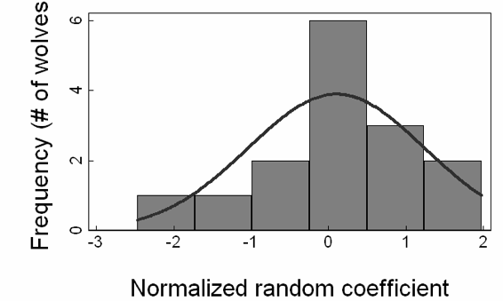

# Lab 7: Mixed-effects RSF Models

Recent advances in the study of resource selection have overcome limitations of inflexible study designs, autocorrelation, and the multi-scale nature of habitat selection.  Resource selection functions (RSFs) estimated by logistic regression are increasingly used in wildlife studies to identify critical resources for animal populations and to predict species occurrence.  When using telemetry data for RSF models, individuals are monitored and often pooled to estimate population-level RSFs without regard to group-(strata, spatial, etc.) or individual-level variation.  Pooling assumes both observations and their errors are independent and, resource selection is constant given individual variation in resource availability.  Researchers have identified ways to minimize autocorrelation, but variation between individuals, especially that caused by differences in availability (i.e., functional responses in resource selection) - have not been well addressed.  Here we review random effects models and their application to RSF models to overcome these common limitations of resource selection studies.  



This lab introduces the concepts of the addition of random effects for group-level hierarchical structure in resource selection, and the concept that group-level selection for a particular resource may be variable.

```{r setup, include=FALSE}
require(knitr)
knitr::opts_chunk$set(echo = TRUE)
r <- getOption("repos")
r["CRAN"] <- "https://ftp.osuosl.org/pub/cran/"
options(repos = r)
```

## 0.1 Preliminaries: setting packages

This week we are going to use a variety of packages including:
`packages <- c("ggplot2", "sandwich", "lme4", "lmtest", "merTools", "ResourceSelection", "GGally", "Hmisc", "plotrix", "pander", "lattice", "jstats", "sjstats", "jtools")`
```{r load packages, include=FALSE}
#function to install and load required packages
ipak <- function(pkg){
  new.pkg <- pkg[!(pkg %in% installed.packages()[, "Package"])]
  if (length(new.pkg)) 
    install.packages(new.pkg, dependencies = TRUE)
  sapply(pkg, require, character.only = TRUE)
}

#load or install these packages:
packages <- c("ggplot2", "sandwich", "lme4", "lmtest", "merTools", "ResourceSelection", "GGally", "Hmisc", "plotrix", "pander", "lattice", "jstats", "sjstats", "jtools")
#run function to install packages
ipak(packages)
```
Note lme4 is the workhorse of fitting generalized linear mixed effects models, but also see the following packages
+glmm
+MCMCglmm
+glmmADB
+glmmPQL
Also note that merTools are a set of post-estimation commands written to interface with objects of type merMod, which are created by packages like lme4 (i.e., a mixed-effect model) 

# 1.0 Revisit Wolf Data with Random Effect for Wolf Packs
```{r}
wolfkde2 <- read.csv("Data/wolfkde.csv", header=TRUE, sep = ",", na.strings="NA", dec=".")
wolfkde3 <-na.omit(wolfkde2)
wolfkde3$usedFactor <-as.factor(wolfkde3$usedFactor)

head(wolfkde3)
table(wolfkde2$pack, wolfkde2$used)
```
Note the unbalanced sample sizes between packs

Lets start from last weeks Model selection labs with the top models for this wolf VHF dataset. 
```{r}
top.env <- glm(used ~ Elevation2 + DistFromHighHumanAccess2 + openConif+modConif+closedConif+mixed+herb+shrub+water+burn, family=binomial(logit), data=wolfkde3)
pander(summary(top.env))
ggcoef(top.env, exclude_intercept = TRUE)
```  

Next, we will subset by packs

```{r message=FALSE}
top.env.bv <- glm(used ~ Elevation2 + DistFromHighHumanAccess2 + openConif+modConif+closedConif+mixed+herb+shrub+water+burn, family=binomial(logit), data=wolfkde3, subset=pack== "Bow Valley")
pander(summary(top.env.bv))

## but subset by packs
top.env.rd <- glm(used ~ Elevation2 + DistFromHighHumanAccess2 + openConif+modConif+closedConif+mixed+herb+shrub+water+burn, family=binomial(logit), data=wolfkde3, subset=pack== "Red Deer")
pander(summary(top.env.rd))
```


Note that there are lots of differences between packs that we have already seen before in these well-trodden data.  There are many ways for us to think about modeling differences in resource selection between wolf packs. Today, we will use this as an introduction to mixed-effects models with this simple VHF dataset with 2 wolf packs, and then quickly proceed to more complex GPS data. 

How to fit with one model? HEre we will fit our first GLM model with a random-intercept for each wolf pack, using the R package `lme4` command `glmer` 
Learn more about glmer using:
`?glmer`
and we learn
>Fits a generalized linear mixed-effects model (GLMM). Both fixed effects and random effects are specified via the model formula.

The key new part of the lm equation command is specifying the formula to include the random effects term. In the help file we learn:

>Random-effects terms are distinguished by vertical bars ("|") separating expressions for design matrices from grouping factors.

### What are they and how are they different from fixed effects?
Not single on consensus on how to describe random effects, and they can be used for multiple purposes.
Instead of estimating coefficients for each level of such a grouping factor (so-called fixed effects),

* Grouping factor: normally distributed random variables with predictions being made for each grouping (instead of estimating coefficients for each level of such a grouping factor )
* Accounts for non-independence of multiple measurements are taken from a single unit (individual, nest, population, site, etc)
* "Nuisance" variables: influences you need to account for but aren't really that interested in
* Cannot treat continuous variables as random effects
* A lot of smart people say you should have at least 5 levels of a categorical variable to treat it as a random effect


### How are they applied to linear regression?
You can have random intercepts, random slopes (coefficients) or both:

*Remember that for this model code: y ~ x, there is a mathematical formula behind it:*
y = intercept + beta1*value1		(beta1 is the slope, aka regression coefficeint, or the influence of the covariate)	
In lm(), glm(), lmer() code, the intercept is often implied and we don't have to explicitly write it in:	
  lm(y ~ 1 + x, data = myData)


*Random intercept: The intercept (1) can vary per Individ or Site*
  
  * lmer(y ~ x + (1|Individ), data = mydata)
* lmer(y ~ x + (1|Site), data = mydata)
* Can even have two random intercepts:
  - without interaction: lmer(y ~ (1|Individ) + (1|Site), data = myData)
  - with interaction: lmer(y ~ (1|Individ) + (1|Site) + (1|Individ:Site), data = myData)	

*Random intercept and slope:*
  
  * lmer(y ~ x + (x|Individ), data = mydata)
* Remember x is the regression coefficient (direcion and magnitude, aka slope)
* lmer(height ~ mass + (mass|Individ), data = myData)
  - The effect of mass can vary per individual
  - The intercept can vary per individual	

*Random slope only:The coefficient can vary per Individ*
  
  * lmer(y ~ x + (-1 + x|Individ), data = mydata)	

**Random slopes need a lot of data!**
  

```{r}
top.env.mixed <- glmer(used~Elevation2 + DistFromHighHumanAccess2 + openConif+modConif+closedConif+mixed+herb+shrub+water+burn+(1|pack), data=wolfkde3,family=binomial(link="logit"))
summary(top.env.mixed)
```
Note we got a lot of error messages here including:


```
#fit warnings:
#  Some predictor variables are on very different scales: consider rescaling
#convergence code: 0
# Model failed to converge with max|grad| = 0.912625 (tol = 0.001, component 1)
#Model is nearly unidentifiable: very large eigenvalue
#- Rescale variables?
#Model is nearly unidentifiable: large eigenvalue ratio
#- Rescale variables?
```

## 1.1 Rescaling variables
The error messages from the fit of the wolf data with a random effect for pack tells us that we need to rescale our variables.  What is rescaling? In R, the command 
```
scale(x) 
```
standardizes the data with respect to the mean and standard deviation of x. Note the defaults are to center to 0 and scale by dividing the centered x values by their standard deviation. The new variable has a mean = 0 and are now expressed in units +/- of standard deviations. This is a very common/important step in the fitting of GLMM's. This also has the direct advantage of being able to now directly compare the coefficients of continuous covariates in terms of SDs. Finally, not we do not really ever scale categorical variables.  These coefficients are already expressed in a way that can be compared to each other. 

```{r}
head(wolfkde3)
wolfkde3$Elevation2_sc <-scale(wolfkde3$Elevation2)
hist(wolfkde3$Elevation2)
hist(wolfkde3$Elevation2_sc)
plot(wolfkde3$Elevation2, wolfkde3$Elevation2_sc)
summary(wolfkde3$Elevation2)
summary(wolfkde3$Elevation2_sc)

wolfkde3$DistFromHighHumanAccess2_sc <- scale(wolfkde3$DistFromHighHumanAccess2)
plot(wolfkde3$DistFromHighHumanAccess2, wolfkde3$DistFromHighHumanAccess2_sc, )
```
So we see that scaling a variable still keeps the exact same relationship between the original x variable, here elevation or distance (on the X axis) and the transformed Y variable, which are now reported in units of 1 Standard Deviation.  

**Note that when we rescale a covariate, we do so only for that mean and standard deviation. This gets complicated in multilevel or bayesian models, or, when we are trying to 'map' spatial predictions of a standardized beta coefficient to a landscape with a different mean and standard deviation.  More on this later. 

## Refitting Top Model with Standardized Continuous Data
```{r}
top.env2 <- glm(used ~ Elevation2_sc + DistFromHighHumanAccess2_sc + openConif+modConif+closedConif+mixed+herb+shrub+water+burn, family=binomial(logit), data=wolfkde3)
pander(summary(top.env2))
```

Note that the beta coefficients are now being reported, for continuous covariates, in terms of standard deviation units.  So we would say that for every increase of 1 standard deviation of elevation, the logit beta coefficient changes by - -2.783. Note we have to remember what a standard deviation in elevation is:

```{r}
sd(wolfkde3$Elevation2)
```
So for every 410 m increase in elevation, the odds of wolf use change by
```{r}
exp(top.env2$coefficients[2])
```
So, the odds decrease by a lot, 94%, when you increase by 410 m. EXCERCISE: Go back and calcualte this manually for 400m to check if this makes sense. 

One major advantage of standardized covariates, and coefficients, is that now you can directly compare the coefficients of Elevation and Distance from high human access? Which one has a 'stronger' effect? Elevation. Comparing the categorical landcover coefficients, which one is the strongest ? (burn) 


How now do we fit with one model with our standardized covariates and avoid the nastygram from R earlier?
```{r} 
top.env.mixed2 <- glmer(used~Elevation2_sc + DistFromHighHumanAccess2_sc + openConif+modConif+closedConif+mixed+herb+shrub+water+burn+(1|pack), data=wolfkde3,family=binomial(link="logit"))
summary(top.env.mixed2)
```
See! - nasty error messages are gone. 


## 1.2 Interpreting Random Effects

Now we can also discuss how to interpret the random effects terms. We are now given a variance and standard deviation for the Random effect (here, pack). This is reported in units of standard deviations, which is another nice reason to standardize continuous (and categorical) covariates.  Here, we can interpre that there is a substantially STRONGER response by wolves to elevation than individual level variability. i.e., Beta-elevation = -3.152, and St.Dev wolf = 0.5472, or about 5.7 times stronger response to elevation than individual wolf pack variation. 

Contrast that with the comparison of St.Dev (pack) to the coefficient for Distance from High Human Access = 0.4316.  This tells us that while most wolf packs avoided high human activity, there was more variation between packs in this response than the response. This tells us something about the variability in pack-level responses to human activity. 

Which is best from an AIC perspective?

```{r}
AIC(top.env2, top.env.mixed2, top.env.rd, top.env.bv)
```
Warning message:
In AIC.default(top.env, top.env.mixed, top.env.rd, top.env.bv) :
models are not all fitted to the same number of observations

Note that we get this error message because top.env.rd and top.env.bv are fit with only subsets of the data. However, recall that for 1 dataset, AIC and LL is additive. Thus, the 'additive' AIC of the two 'separate' models is 396.4251 + 851.1538 = 1247.58 which is substantively better than the mixed effect model.

Either way, comparing the fixed-effect versus the mixed-effect model, we can see that the glmm is far better. However, a simpler model with two separate models, one for each wolf pack, explained the dataset better. But in practice, we would almost never fit a model with just 2 levels of a random effect, so now we will go to a more 'sensible' dataset. 


# Mixed-effects Models with Migrant Elk

Yeah! we will analyze some data besides the now very tired wolf data. We will use elk GPS collar data from migratory elk in our long-term Ya Ha Tinda elk study system. These data are based on: 

Hebblewhite, M., and E. H. Merrill. 2009. Trade-offs between predation risk and forage differ between migrant strategies in a migratory ungulate. Ecology 90:3445-3454.

and the data are available 'free' here:

Hebblewhite, M., and E. H. Merrill. 2016. Data from: A multi-scale test of the forage maturation hypothesis in a partially migratory ungulate population. Movebank Data Repository. Movebank Data Repository.


For background, trade-offs between predation risk and forage fundamentally drive resource selection by animals. Among migratory ungulates, trade-offs can occur at large spatial scales through migration, which allows an ‘‘escape’’ from predation, but trade-offs can also occur at finer spatial scales. Previous authors suggest that ungulates will avoid predation risk at the largest scale, although few studies have examined multi-scale trade-offs to test for the relative benefits of risk avoidance across scales. Building on previously developed spatial models of forage and wolf predation risk, we tested for trade-offs at the broad landscape scale and at a finer, within-home-range scale for migratory and non-migratory resident elk (Cervus candansis) during summer in the Canadian Rockies in Banff National Park (BNP) and adjacent Alberta,
Canada.

## 2.1 Exploring and managing data
```{r}
# Bring in data
elk <- read.table("Data/lab7_elk_migrant.csv", header=TRUE, sep=",", na.strings="NA", dec=".", strip.white=TRUE)
head(elk)
elk$elkuidF <- as.factor(elk$elkuid)

# get to know our data
table(elk$elkuid, elk$year)
table(elk$elkuid, elk$used)
```

Get to know our data graphically
```{r}
ggplot(elk, aes(x=utmx, y = utmy, color = elkuidF)) + geom_point()
```
Next, how about 'just' the telemetry locations?
```{r}
elk.used <- subset(elk, elk$used == 1)
ggplot(elk.used, aes(x=utmx, y = utmy, color = elkuidF)) + geom_point()
write.csv(elk.used, "Data/lab8_elk_migrant_used.csv")  ## we might want to use this later, like in Lab 8
```
What kind of sampling design and scale is this?

So there are some data from 2003, most from 2004, 1 elk from 2002.  And there is wide variation in the number of used and available locations for each elk from 52 (elk 90 0's) to 3711 (elk 29 0's). Any guess why there is variation in the number of 0's?  Home range size: # of locations was based on an areal basis.

Today, we are going to be conducting an RSF as a function of Forage Biomass (totalherb) and wolf predation risk (ctotrisk).  Lets look at these two variables and get to know them. 
```{r}
hist(elk$ctotrisk)
hist(log(elk$ctotrisk))

summary(elk[,30:31]) ## So 1579 NA's predation risk values, and 11 NA's for total herbaceous vegetation
length(elk$ctotrisk)
```

So we need to subset dataset for complete.cases where there are no NA data - why is this important?  How can we compare models using AIC with different number of rows?
```{r}
elk2 <- elk[complete.cases(elk[30:31]), ]
summary(elk2)
length(elk2$ctotrisk)
```

Next, we still need to clean up predation risk data being predicted > 1
```{r}
elk2$ctotrisk[elk2$ctotrisk>1]=1
table(elk2$elkuid, elk2$year)
table(elk2$elkuid, elk2$used)

# Compute sample size for each elk
n = tapply(elk$idn, elk$elkuid,length)
n
```

Next, lets calculate mean wolf predation risk
```{r}
wolf = tapply(na.omit(elk2$ctotrisk), elk2$elkuid[which((elk2$ctotrisk!="NA")==TRUE)],mean)
wolf
hist(wolf)
```
This shows a wide variation in the exposure of elk to wolf predation risk. 

```{r}
forage = tapply(na.omit(elk2$totalherb), elk$elkuid[which((elk2$totalherb!="NA")==TRUE)],mean)
forage
hist(forage)
```
And quite a bit of variation, but not as much - absolutely - in the exposure to forage biomass (again, reported as g/m^2). 

## 2.1 Scaling risk and forage
Following the above, we recall that to fit GLMM we will always need to center and scale (scale) variables to make estimation efficient. 
```{r}
elk2$totalherb_sc <- scale(elk2$totalherb)
elk2$ctotrisk_sc <- scale(elk2$ctotrisk)
elk2$ctotrisk2_sc <- scale(elk2$ctotrisk2)
elk2$riskforage_sc <- scale(elk2$riskforage)
elk2$for2_sc <- scale(elk2$for2)
elk2$risk2_sc <- scale(elk2$risk2)

##### AGain, just to double check what scale is doing
plot(elk2$ctotrisk_sc, elk2$ctotrisk)
```

## Fitting Standard Fixed-Effects Model and Understanding Ecology

First, we are going to explore the straight forward RSF using the model from the Hebblewhite & Merrill (2009) paper discussed in class where migrant elk make trade-offs between risk and forage at the home range scale, as well as their interaction between risk and forage. We are not going to concern ourselves with model selection questions in this lab, but instead consider elk resource selection to be a function of wolf predation risk, total herbaceous forage biomass (g/m2) and their interaction.  

```{r}
# Fitting best model(s)
forage = glm(used~totalherb, data=elk2,family=binomial(link="logit"))
risk = glm(used~ctotrisk, data=elk2,family=binomial(link="logit"))
forANDrisk = glm(used~totalherb+ctotrisk, data=elk2,family=binomial(link="logit"))
forrisk = glm(used~totalherb+ctotrisk+ctotrisk*totalherb, data=elk2,family=binomial(link="logit"))

AIC(forage, risk, forANDrisk, forrisk)
```

So, the best model from AIC perspective is forrisk
```{r}
summary(forrisk)
ggcoef(forrisk, exclude_intercept = TRUE)
```

Ecologically, what does this model say to us? There is some intercept, which we now now is fundamentally related to the sampling fraction of used : available locations, so we don't pay it much attention.  We see that the probability of elk use increases with increasing forage biomass (B-totalherb = 0.045), increases with increasing predation risk (B-ctotrisk = 0.48) - which at first is a bit puzzling. Why would elk select areas of higher predation risk?  But then we note the very strong effect of the NEGATIVE interaction between total predation risk and herbaceous biomass (B-f*p = -0.059). A negative interaction is logically interpreted as reduced probabiltiy of elk use with increasing forage and/or predation.  But interpreting an interaction in a logistic regression model of any kind is complicated.  We will graph this later. 

## Refit top model with scaled

Now we will refit the same model wtih scaled coefficients, that makes comparing the coefficients easier, though we note that the Z-values and P-values remain nearly identical. 
```{r}
forrisk_sc = glm(used~totalherb_sc+ctotrisk_sc+ctotrisk_sc*totalherb_sc, data=elk2,family=binomial(link="logit"))
summary(forrisk_sc)
ggcoef(forrisk_sc, exclude_intercept = TRUE)
```
This tells us the same, but oddly, note that the main effects for predation risk are now negative, not positive.  Question - WHY????

hint:

```{r}
hist(elk2$ctotrisk)
```
What does centering and scaling do? What is the mean of ctotrisk?
```{r}
mean(elk2$ctotrisk)
```
So, when total predation risk is greater than the mean predation risk, which is 0 in the scaled model, the effect is that increasing risk here causes a reduction in elk use.  This is rescaled, and the same data as the unscaled model, but centering and scaling can cause flips in the signs of coefficients that have to do with the underlying distribution of the covariate, here, risk, which is VERY right skewed. 

Practically, the intepretation will remain exactly the same. But beware the distribution of the underlying X variables will and can cause challenges in interpretation of the rescaled beta coefficients. For this reason, I almost always start with unscaled 'raw' data to understand any potential challenges in interpretation. 

## Visualizing the Interaction from the Unstandardized Fixed-effects model

As we have discussed a bit in class, interpreting interactions in ANY linear model is challenging. Especially binary responses.  So, here, we will visualize the interaction for the rescaled models. 
```{r}
# Calculate some summary statistics for forage
hist(elk$totalherb)
hist(log(elk$totalherb))
quantile(elk$totalherb,na.rm=TRUE)
mean(elk$totalherb,na.rm=TRUE)

herb.lo = 5
herb.med = 15
herb.hi = 50
```

# Make predictions
Now we will make predictions for the top model, forrisk, given these new data for the low, medium and high levels of forage, and the actual values of predation risk by wolves. 
```{r}
predrisk = seq(0,1,0.01)
pred.lo = predict(forrisk,type="response", newdata = data.frame(totalherb=herb.lo, ctotrisk=predrisk))
pred.med = predict(forrisk,type="response", newdata = data.frame(totalherb=herb.med, ctotrisk=predrisk))
pred.hi = predict(forrisk,type="response", newdata = data.frame(totalherb=herb.hi, ctotrisk=predrisk))

# Make plot
plot(elk2$ctotrisk,elk2$used, xlab="Risk", ylab="Pr(Use)")
lines(predrisk,pred.lo, lty=1)
lines(predrisk,pred.med, lty=2)
lines(predrisk,pred.hi, lty=3)
legend(x=0.7,y=0.95, legend=c("Observed","Low Forage","Medium Forage","High Forage"), pch=c(1,rep(-1,3)),lty=c(-1,1:3),bty="n")
```

Note here that the effects of wolf predation risk on the Pr(Elk Use) vary with forage levels.  This is the essence of an interaction. We see that under low forage levels, elk barely respond to wolf predation risk.  Conversely, at higher forage levels, elk SWITCH to avoiding areas of high predation risk.  I wonder why this is?  Of course, the answer lies in what wolves are doing :)

## Visualizing the interactions with ggplot2

I often use ggplot2 to help visual interactions in glm(er) type models.  I first make 
```{r}
elk2$usedF <- as.factor(elk2$used)
ggplot(elk2, aes(x=ctotrisk, y = used)) + stat_smooth(method="glm", method.args = list(family="binomial"))
ggplot(elk2, aes(x=totalherb, y = used)) + stat_smooth(method="glm", method.args = list(family="binomial"))
ggplot(elk2, aes(x=riskforage, y = used)) + geom_rug() + stat_smooth(method="glm", method.args = list(family="binomial"))
```
But what does this last plot mean? Need to make a categorical variable at 3 different levels of forage, and then facet or fill by this new variable, herbaceous forage class. 

Note I use the Hmisc package here to split into categories
```{r}
elk2$forage.cat  <- as.factor(as.numeric(cut2(elk2$totalherb, g=3)))
elk2$forage.cat  <- cut2(elk2$totalherb, g=3)
ggplot(elk2, aes(x=ctotrisk, y = used, fill = forage.cat)) + stat_smooth(method="glm", method.args = list(family="binomial"))
```
note this plot looks different than the interaction I made above, with mean levels of 5, 15, and 50. But this is for different classes, and, not just a fixed level, but the mean value in that category. But it shows the same trend, that there is a flip in how elk respond to wolf predation risk at low and moderate to high forage values. 

Note we can flip the interaction and view it from the wolf predation risk perspective. 
```{r}
elk2$risk.cat  <- cut2(elk2$ctotrisk, g=3)
ggplot(elk2, aes(x=totalherb, y = used, fill = risk.cat)) + stat_smooth(method="glm", method.args = list(family="binomial"))
```
Both graphs show that the effect of the interaction is only really present at low forage levels when elk select for high predation risk, but otherwise they select high forage biomass at all times, just less when under high predation risk.   But a key take home point here is to ALWAYS explore 2-way interactions BOTH ways, wihch each variable on the X-axis. 


## Visualizing the Marginal Effects with Resource Selection Marginal Effects 'mep'
This is from the Resource Selection package by Subhash Lele, and is a nice plot.  However, it does not do interactive effects. It is based on this paper: 

Avgar, T., Lele, S. R., Keim, J. L. & Boyce, M. S. (2017) Relative Selection Strength: Quantifying effect size in habitat- and step-selection inference. Ecology and Evolution 7, 5322–5330.

```{r}
mep(forrisk_sc)
```

Note, so far, all we have done is explore this model with fixed effects, and got to understand its ecology. WE have not dealt with the basic problem so far that there is a lot of unmodeled heterogeneity between elk in our dataset driven by 3 main things; 

1) Differences between elk in the variance and correlation within elk locations (basic assumption of independence of the observations)
2) Differences between elk in the number of locations simply because of sampling (observation process). 
3) Differences between elk in the actual responses to these ecological covariates (biological process)

Next, we will explore some basic early approaches to dealing with the 1st problem, unmodeled heterogeneity, using sandwhich estimators. 

# Robust Standard Errors with Clustering 

This is a demonstration of the Newey-West Sandwhich Estimator - i.e., clustering the standard errors taking into account autocorrelation within an individual elk, Heterskedasticity.  All clustering does is account for the pseudoreplication within sample units, handy yes. 

The relevant paper demonstrating it with RSF models is: Nielsen, S. E., M. S. Boyce, G. B. Stenhouse, and R. H. Munro. 2002. Modeling grizzly bear habitats in the Yellowhead ecosystem of Alberta: taking autocorrelation seriously. Ursus 13:45-56.

This next command vcovHC generates the default heteroskedastic robust standard errors in R using the cvocHC() function in the sandwhich based package. 
```{r}
forrisk2 <-vcovHC(forrisk, elk$elkuid, type = "const", sandwhich = TRUE)
forrisk2

coeftest(forrisk, forrisk2)
```
Compare the SE's that are robust and not robust for comparison but without a cluster variable.  This reports a z-test statistic and associated P-value for whether there is a difference in the estimate of the two coefficients from the two models. This is a handy function in general to test the coefficients from 2 models of any type with the same structure. Here it tells us that there is a difference in the intercept (not really that ecologically interesting) and a difference in forage between the two models.  Because the Z-statistic is positive, 0.04 for totalherb, that tells us that failing to take into account the 'clustering' within individuals leads us to overestimate the effect of forage. 

While the Newey-West Sandwhich estimator can help tell you when you have unmodeled heterogeneity, its generally not recommended when we have other alternatives present.  

# Fixed-effects Models with a Fixed-Effect for Each Individual Elk

Now we will fit a fixed-effects model with a fixed effect intercept for each individual elk, i.e., with 1 intercept per elk. Note we will use elkuidF as the factor here. 

```{r}
forriskFI = glm(used~totalherb+ctotrisk+ctotrisk*totalherb+elkuidF, data=elk,family=binomial(link="logit"))
summary(forriskFI)
ggcoef(forriskFI, exclude_intercept = TRUE)
```

Discussion - what does each coefficient mean in a used-available design? What is the correspondance between the sampling ratio of used to available locations and the coefficient?
```{r}
table(elk2$elkuid, elk2$used)
```
Check for elk 196, 141/(141+1120) = 0.557; B is 0.502 - close enough in multiple logit model with continuous covariates. 

There is absolutely nothing wrong with using a fixed factor for individual or groups instead of random effects. Manly chapter 5 covers this.  However, why would we not just want to use this fixed effect? There are 2 reasons. First, philosophical - having to do with wanting to make inferences beyond just our radiocollared sample. And second, the penalty of estimating all these additional coefficients for each individual elk. See here: 

```{r}
AIC(forriskFI, forage, risk, forANDrisk, forrisk)
```
 The main issue is the greater number of parameters, here, 1 for each individual elk. But, from an AIC perspective, the fixed-effects of each individual elk provide a better 'fit'. But again, remember what the intercept means in a used-available design.

# Two-Stage Modeling

Next we will explore the 'poor-mans' version of mixed-effects models, somewhere between fitting a fixed-effect for each individual elk and a full mixed-effect model. While I call it a poor-mans version, it is honestly the first thing I do with any complex dataset to understand where the variation where the main sources of variation are coming from. 

The best papers to read here are: 

Fieberg, J., J. Matthiopoulos, M. Hebblewhite, M. S. Boyce, and J. L. Frair. 2010. Correlation and studies of habitat selection: problem, red herring or opportunity? Philosophical Transactions of the Royal Society B: Biological Sciences 365:2233-2244., 

and 

Murtaugh, P. A. 2007. Simplicity and complexity in ecological data analysis. Ecology 88:56-62. and

Sawyer, H., R. M. Nielson, F. Lindzey, and L. L. Mcdonald. 2006. Winter Habitat Selection of Mule Deer Before and During Development of a Natural Gas Field. Journal of Wildlife Management 70:396-403, and 

## Fixed Effects Model for Each Individual
The first step I take is to fit one individual model to each individual elk or sampling unit. 
```{r}
elkids = sort(unique(elk2$elkuid))
modelnames = paste("elk",elkids)
models = list()

for (i in 1:length(elkids)){
	models[[i]]=glm(used~totalherb_sc+ctotrisk_sc+ctotrisk_sc*totalherb_sc, data=elk2,subset = elkuid==elkids[i], family=binomial(link="logit"))

}

names(models)=modelnames
#lapply(models,summary) #### Note I supressed this because it just spits out 17 models, 1 for each elk

# This creates a dataframe with the beta coefficients for each model/elk
coefs = as.data.frame(lapply(models, coef))
coefs

#Calculate means for each of the coefficients
mean(as.numeric(coefs[1,]))
mean(as.numeric(coefs[2,]))
mean(as.numeric(coefs[3,]))
mean(as.numeric(coefs[4,]))
```

Therefore, the linear part of the two-staged model would be:
```
Y =  -2.15 - 1.417xtotalherb_sc -6.006xctotrisk_sc + 6.657*totalherb_sc:ctotrisk_sc
```
Next, let us make some graphical displays of the Beta coefficients across individuals

```{r}
par(mfrow=c(2,2))
hist(as.numeric(coefs[1,]), main="intercept",breaks=10)
hist(as.numeric(coefs[2,]), main="Forage",breaks=10)
hist(as.numeric(coefs[3,]), main ="Risk",breaks=10)
hist(as.numeric(coefs[4,]), main="Forage*Risk",breaks=10)
```
So a biological conclusions is that there is substantial variation between individuals in their coefficients for forage, wolf predation risk and the interaction. 

# Mixed-Effects Models!

## Mixed-effects model with random intercept

We will review again in class what a random intercept means in the context of a Used-Available Design. Lets start by fitting the model with a random intercept for each individual elk.  The key paper here is:

Gillies, C., M. Hebblewhite, S. E. Nielsen, M. Krawchuk, C. Aldridge, J. Frair, C. Stevens, D. J. Saher, and C. Jerde. 2006. Application of random effects to the study of resource selection by animals. Journal of Animal Ecology 75:887-898.


```{r}
fr.ri = glmer(used~totalherb_sc+ctotrisk_sc+ctotrisk_sc*totalherb_sc+(1|elkuid), data=elk2,family=binomial(link="logit"), verbose=FALSE)
summary(fr.ri)
```
Lets review how to interpret the Random Effects. Here, they are saying we have 17 elk with 34,390 rows of data, and the Std. Dev = 0.7899, which, compared to our standardized coefficient estimates for total herb and wolf risk are relatively huge. That is, another way of saying there is substantial individual-level variation in resource selection between individuals, equal to or greater than the variation in the actual strength of selection.  This is an important insight, confirming what we already learned from our Two-stage modeling above. 

Its important to look at confidence intervals around our Beta estimates, not just the SE's. We can compute these using confint() are a reminder. There are multiple methods to choose from; we will use Wald here, but note that bootstrat CI's are generally considered the 'best'.   Refresh here: 
`confint()`
```{r}
confint(fr.ri, method = "Wald")
```
`confint(fr.ri, method = "boot")`
`confint(fr.ri, method = "profile")`


Lets remind ourselves of the model structure and 'new' parameters being estimated with the 95% confidence intervals graphically. 
```{r}
ggcoef(fr.ri)
```
Note now we have 1 more parameter being estimated, the sd in the intercept.  This counts in parameters towards AIC - never forget it. 

# Learning about How GLMM's are Being Fit

By default, R is fitting the GLMM by Laplace approximation to the MLE estimator, which by default is 1 decimal place/point (numerical integration points) at which the model is fit with Adaptive Gauss-Hermite Quadrature.  The recommended # of nip points is >> 5 for most binomial GLMM's. We set this by changing the nACQ - integer scalar's. 

nAGQ- integer scalar - the number of points per axis for evaluating the adaptive Gauss-Hermite approximation to the log-likelihood. Defaults to 1, corresponding to the Laplace approximation. Values greater than 1 produce greater accuracy in the evaluation of the log-likelihood at the expense of speed. A value of zero uses a faster but less exact form of parameter estimation for GLMMs by optimizing the random effects and the fixed-effects coefficients in the penalized iteratively reweighted least squares step. The key paper is:

Rabe-Hesketh, S., A. Skrondal, and A. Pickles. 2005. Maximum Likelihood Estimation of Limited and Discrete Dependent Variable Models With Nested Random Effects. Journal of Econometrics 128:301-323.

```{r}
fr.ri2 = glmer(used~totalherb_sc+ctotrisk_sc+ctotrisk_sc*totalherb_sc+(1|elkuid), data=elk2,family=binomial(link="logit"), verbose=FALSE, nAGQ = 10)
summary(fr.ri2)
```
Note there really is no major effect in this dataset.  But - good to know.  Also note that it takes a lot longer to fit the model. 

## Comparing Random Intercept Model and Two-Stage Model Coefficients

It is often useful to compare the beta coefficients from 'manual' two-stage models, and the random intercept model to help you interpret them.  We extract the coefficients from a random effects model using two sets of commands:
`fixef()` which extracts the fixed-effects coefficients.  And
`ranef()` which extracts the random effects, which in this model is just (1|elkuid), so, one coefficient for each individual elk
```{r}
# Useful functions
fixef(fr.ri) 
ranef(fr.ri)
```
Compare these to the fixed effect coefficients estimated with an intercept for each individual elk? How do they compare?

Or, we can look at both fixed- and random-effects from a random effects model using this where the intercept is the fixed effect intercept + the random effect intercept for elkuid = 1...n. 
```{r}
coef(fr.ri) 
```
Note this shows you the entire coefficient matrix for all individual elk - note that the rest of the model is fixed for each individual elk. 

Next we will compare the intercepts from two step and mixed-effects model.  This forces us to think about what the interpretation of a random intercept is in a used-available design.  First, I out everything in one place; I add the fixed intercept to the random effects here.Note you could also get this from coef(fr.ri) as we just did. 
```{r}
B0 <- cbind(as.numeric(coefs[1,]),ranef(fr.ri)$elkuid[,1]+fixef(fr.ri)[1])
rownames(B0)=rownames(ranef(fr.ri)$elkuid)
colnames(B0) = c("Two-Step","Random Effects")
str(B0)
B0
par(mfrow=c(1,1))
plot(B0[,1], B0[, 2])
abline(lm(B0[,1] ~ B0[, 2]))
```
This plot shows the Two-step coefficients for each individual elk on the X axix, and the random coefficient for each individual elk from the GLMM on the Y-axis. What do you notice? What are the axes of Y and X here?  Should there be a relationship between these two?

Suprisingly, there is no real relationship between the fixed-effects estimates from the two-stage models for the intercept. Why is this? Lets take a look at the histogram of both:
```{r}
# Make a histogram using the package plotrix
multhist(list(B0[,1],B0[,2]), xlab = "Intercept Coefficient",ylab="Frequency (# Elk)", col = c("gray","tan"))
legend("topright", legend = colnames(B0), fill = c("gray","tan"), bty = "n")
```
This histogram shows us that the mixed-effects model is estimating the distribution of random intercepts here as 'more' gaussian/normally distributed than the Two-stage data.  This introduces us to the new 6th assumption of any GLMM, here, binomial. Remember assumptions 1 - 4:

1. That the data are independent. 
2. That they are identically distributed, whether it be normal ~ N(0, sigma), binomial, etc.  
3. That the X's are measured without error.
4. That the data are homogenously distributed. 
5. In Multiple regression, the X's are independent. 

And, now, with GLMM, 
6. That the random effects are distributed as a gaussian random variable with mean mu, and variance sigma squared. 

It is this new 6th assumption, that the random effects have a DISTRIBUTION, whic is causing the shrinkage in the estimated beta coefficients for the intercept.  We will discuss this assumption later in class. But go back and look at the estimated beta coefficients in Figure 1 above for wolves. 

So far, we have just accounted for the first and second problem that random effects are well-suited to address, 1. modeled heterogeneity, and 2. variation in sampling intensity between individuals. This has nothing to do with actual differences in how elk respond to forage or predation. for this, we need the final ingredient, adding random coefficients. 

## Random Coefficients - Mixed Effects Model with Random Coefficient

Based on our previous two-step models above, we can see there is a lot more variation in the response of elk to total predation risk.  So, here we will fit random coefficients for the first time to wolf predation risk. 

```{r}
fr.rc = glmer(used~totalherb_sc+ctotrisk_sc+totalherb_sc*ctotrisk_sc+(ctotrisk_sc|elkuid), data=elk2,family=binomial(link="logit"), verbose=FALSE)

fixef(fr.rc) # This is the fixed effects coefficients
ranef(fr.rc) # These are the random effects, which in this model is just (1|elkuid), so, one coefficient for each individual elk
```
First, note that fitting random coefficients took a long time with EVEN this modest dataset. Compare these to the fixed effect coefficients estimated with an intercept for each individual elk? How do they compare?
```{r}
coef(fr.rc)
##### Note here that the coefficient for predation risk is allowed to vary
summary(fr.rc)
```

Again, look at the Std.Dev of the random effects for elkuid (intercept) and wolfpredation risk, 8.533. That is DOUBLE the strength of the coefficient for wolf predation risk in the model. Also note that the coefficient for wolf predation risk has dramatically changed, becoming much stronger now. 

NExt, we now see the correlation between the two random effects here, which is 0.97.  This means that there is a positive covariance between animals with a high value for a random intercept, and animals with a larger coefficient (more positive) for wolf predation risk. Interpreting this is tricky.  Think of what a positive intercept means in a used-available design - this means that they have more 1's than 0's, so, a smaller home range the way that we sampled availability based on areal extent. Why would animals with small home ranges be 'selecting' areas of higher predation risk compared to animals with larger home ranges? This is a real ecologically interesting question to ponder with this dataset. 

We also see below the output the Correlation of Fixed Effects: This is a bit tricky to interpret. The "correlation of fixed effects" output doesn't have the intuitive meaning that most would ascribe to it. Specifically, is not about the correlation of the variables. It is in fact about the expected correlation of the regression coefficients. Although this may speak to multicollinearity it does not necessarily. In this case it is telling you that if you did the experiment again and it so happened that the coefficient for forage got smaller, it would not be correlated with the coefficient for wolf predation risk. In fact, in these Correlations of fixed effects, there is nothing too alarming here; the fact that wolf predation risk and the intercept values were positively correlated was already noted above with the random effects, and discussed above. But, if these fixed-effect coefficients were highly correlated, and the real coefficients, not just the intercepts, that would be more problematic and might suggest problems with confounding or collinearity. 

## Lets Visualize the Random Intercept and Coefficient
We use the lattice package. 
```{r}
lattice::dotplot(ranef(fr.rc, condVar = TRUE))
```

## Compare Parameters between Two-stage and Mixed-Models
Note that I use the coef function here
```{r}
B0.rc = cbind(as.numeric(coefs[1,]),coef(fr.rc)$elkuid[,1])
rownames(B0.rc)=rownames(ranef(fr.ri)$elkuid)
colnames(B0.rc) = c("Two-Step","Random Effects")
B.risk = cbind(as.numeric(coefs[3,]),coef(fr.rc)$elkuid[,3])
rownames(B.risk)=rownames(ranef(fr.ri)$elkuid)
colnames(B.risk) = c("Two-Step","Random Effects")

## lets look at the Intercepts
B0.rc
```

Next, lets look at the risk coefficients
```{r}
B.risk
```
So, quite correlated from the 2 different models
```{r}
plot(B.risk[,1], B.risk[,2])
abline(lm(B.risk[,1] ~ B.risk[, 2]))
```
So here there is some correlation between the coefficients for predation risk from the Two-stage models (X-axis) and the glmm (Y axis). Now we are getting somewhere and this is starting to make more sense. Remember the intercepts are not really that meaningful in these Used-available rSF models, but here we see correlation in the coefficients - what matters. 

Lets look at histograms of the Beta coefficients to visualize the difference in the two-stage beta's (without the 6th assumption of GLMM) and those of the GLMM where the distribution of random effects is assumed to be normal. 
```{r}
# Make histogram of betas
par(mfrow = c(1,2))
multhist(list(B0.rc[,1],B0.rc[,2]), xlab = "Intercept Coefficient",ylab="Frequency (# Elk)", col = c("gray","tan"), ylim=c(0,10))
legend(2.4,10, legend = colnames(B0), fill = c("gray","tan"), bty = "n")
multhist(list(B.risk[,1],B.risk[,2]), xlab = "Risk Coefficient",ylab="Frequency (# Elk)", col = c("gray","tan"),ylim = c(0,10))
legend(2.4,10, legend = colnames(B0), fill = c("gray","tan"), bty = "n")
```
What is the assumption about the distribution of the random effects doing to the modeled responses here?

# Model Selection with Random Effects

Finally, one might be tempted to rely on AIC to tell us which model is the best.  Lets take a look!
```{r}
AIC(forriskFI, forage, risk, forANDrisk, forrisk, fr.ri, fr.rc)
```
So hands down, the top model here is a random effect of wolf predation risk, beating even the fixed-effect of each individual elk as an intercept (forriskFI). Note that model selection with random effects models gets a lot more complicated... here we are doing model selection on the Fixed-effects only. 
What I mean is that it is possible to do model selection not only on the fixed-effects, but also the random effects. This is especially complicated in multi-level models with more than one hierarchy, like wolves in packs.  Or children in schools in school districts (3).  Now one can do model selection at each level of the hierarchy over and above the fixed-effects.  See: 

Vaida, F., and S. Blanchard. 2005. Conditional Akaike information for mixed-effects models. Biometrika 92:351-370.

## Comparing Models with and without Random Effects

One often wants to know, besides AIC, how much 'better' a top model is with a random effect compared to one without. How do we determine the "importance/significance" of the random effect?
  
  * Compare estimate of random effects SD to the magnitude of the fixed effect
+ If the values are close, this means that the random effect groups (for us, NewID) vary a lot relative to the magnitude of the effect of mass
* Use a likelihood ratio test (anova()) to compare the output of the model with and without the random effect * One other thing to keep in mind is that if we are including random effect(s) in our model because of experimental/survey design (for example because of non-independence between samples), then significance is not really that important, and they should be included regardless.

Lets use ANOVA to conduct a LRT of the hypothesis that the full random effects model with a random coefficient and intercept fit 'better' than the null, fixed-effects model.  Always put the more complex model, the GLMM in this case, first. 
```{r}
anova(fr.rc, forrisk, test = "Chisq") ## put GLMM first
```
Here, AIC and BIC are much MUCH better, the LL is higher, and the chi-square is >>> which tells us that the fr.rc model is a huge improvemetn in fit.  Lets compare the random intercept only model. 

```{r}
anova(fr.rc, fr.ri, test = "Chisq") ## put GLMM first
```
Not as huge an improvement, but, still a big jump in improvement. 

## Variance Explained by GLMM's 

We can get the summary of the model fit in an alternative way using the summ() function from the ‘jtools’ package. This provides a value for Pseudo-R-squared. The first value is the marginal R-squared describes the proportion of variance explained by the fixed factor(s) alone. The second value is the conditional R-squared describes the proportion of variance explained by both the fixed and random factors

```{r}
jtools::summ(fr.rc, confint = TRUE, digits =2)
```
We can also look at the intra-class correlation value using the icc() function from ‘sjstats’ package. First let’s use it on an intercept-only model on our elk data, then our model with the random effect of unit.

```{r, warning = FALSE}
performance::icc(fr.rc)
```
This value tells us how much variation in the response comes from the grouping/clustering structure of our data. Here it is high, so, as the likelihood ratio test for this data set also indicated, there is support for including the random effect. Let’s compare this to the intra-class correclation value from our model with only a random intercept for individual elk. 

```{r, warning = FALSE}
performance::icc(fr.ri)
```
Which again aligns with our LRT results. 

# Predictions from GLMM RSF models. 

A related concept to the challenge of model selection with either the fixed- or conditional- effects is prediction.  Obtaining predictions from GLMM Models is tricky. What are you trying to predict is the challenging question? Marginal or population-averaged responses? Conditional or subject specific responses?  

Moreover, a challenge remains in how best to actually use the models with random effects in it to make predictions, so there are a number of packages and discussions that essentially recommend bootrapping or simulation approaches. All of this ends up taking us to a Bayesian framework eventually.

## Plotting Predictions from Random Coefficient models
We will make predictions here using the fixed-effect coefficients (i.e., a marginal level prediction). 

First lets refit the top model with out scaled coefficients - note this takes a LOT longer.  Why am i doing this? To predict in the REAL scale!  Models fit with scaled covariates make predictions in standard deviation units. 
```{r}
fr.rc2 = glmer(used~totalherb+ctotrisk+totalherb*ctotrisk+(ctotrisk|elkuid), data=elk2,family=binomial(link="logit"), verbose=FALSE)
summary(fr.rc2)
```

Next we will plot predictions from random coefficient model. First we will remove NAs from the data
```{r}
elk.c = elk2[which((elk2$ctotrisk!="NA"&elk2$totalherb!="NA")==TRUE),]
```

Then we will plot observed use for each elk by looping over each elkuid. 
```{r}
par(mfrow = c(1,1))
plot(elk.c$ctotrisk, elk.c$used,xlab="Risk",ylab="Pr(Use)")
elkids = sort(unique(elk.c$elkuid))
ltypes = rep(1:6,each=3)
lwide = rep(seq(1,3,1),each = 6)
colors = rep(c("red","black","seagreen", "violet", "tan", "orange"),3)

# Begin loop
for (i in elkids){
  # To plot predictions you need to create new data for just that elk
  dat = as.data.frame(model.matrix(terms(fr.rc2),elk.c)[elk.c$elkuid==i,])
  dat$totalherb = mean(dat$totalherb) # Use the mean forage for an elk
  dat[,colnames(dat)=="totalherb:ctotrisk"] = dat$totalherb*dat$ctotrisk # Recalculate the interaction term with the mean forage
  dat$pred.prob = plogis(as.matrix(dat)%*%t(as.matrix(coef(fr.rc2)$elkuid[which(elkids==i),]))) # Use matrix algebra to get prediction based on coefficients for each individual elk
  ord = order(dat$ctotrisk) # store the order we want to plot in
  # Draw a line for you prediction
  lines(dat$ctotrisk[ord], dat$pred.prob[ord], lty=ltypes[which(elkids==i)],lwd = lwide[which(elkids==i)],col=colors[which(elkids==i)])
}

legend("right", legend = c("Observed", paste("Elk ",elkids)), pch=c(1,rep(-1,length(elkids))),lty = c(-1,ltypes[1:length(elkids)]),lwd = c(-1,lwide[1:length(elkids)]),col = c(1,colors[1:length(elkids)]), bty = "n")

```

When I first taught this class using these data, this graph BLEW my mind.  I had happily published our 2009 paper talking all about the marginal, population-level fixed effects. I had completely overlooked the huge amount of individual-level variation present in even this SIMPLE dataset.  I was humbled. This lead to a french MS thesis by Amelie Paoli with Christophe Bonenfant at Universite Lyon 1, Claude Bernard. 

## Plotting Conditional Predictions with 95% CI's

We can use a handy function in ggplot to fill by each individual elk like this as an initial exploration, noting that this is equivalent functionally to the two stage models above. 
```{r}
ggplot(elk2, aes(x=ctotrisk, y = used, colour = elkuidF)) + stat_smooth(method="glm", method.args = list(family="binomial"))
```
Although a few things are wrong with this model. First, the model predictions are based on the fixed-effects, and fixed-effects variance (only) not taking into account the random effects variance.  So the 95% CI's are almost certainly overly precise compared to if they had included the random effects variance. 

Prediction is a HUGE challenge in mixed-effects models! And there are HUGE amounts of pages dedicated to it. Here are just a few pages
https://cran.r-project.org/web/packages/merTools/vignettes/Using_predictInterval.html

## Predicting with predict() function
?predict.merMod

First we do the basic predictions which are the fixed-effects ignoring random effects
```{r}
elk2$naive.pred <-predict(forrisk, type = "response")
elk2$fr.rc.pred <- predict(fr.rc, type = "response")
hist(elk2$fr.rc.pred)
```

Next, we do the basic predictions which are the fixed-effects unconditional on the random effects (i.e., Naive logit)
```{r}
elk2$fr.rc.pred2 <- predict(fr.rc, re.form = NA, type = "response")
summary(elk2$fr.rc.pred2)
```
But note now we can make predictions for JUST individual elk ignoring the variation between individuals in predation risk responses
```{r}
elk2$fr.rc.pred3 <- predict(fr.rc, re.form = ~(1|elkuid) , type = "response")
summary(elk2$fr.rc.pred3)
hist(elk2$fr.rc.pred3)
```

Finally, we visualize relationships between different predictions, the naive model (pred2) versus the full random intercept and random coefficient model. 
```{r}
plot(elk2$fr.rc.pred2, elk2$fr.rc.pred)
```
This is the plot of the predictions from the unconditional predictions (X) versus the fully-specified random effects of risk|elkid (y). But this isnt as complicated as it can get. 
```{r}
ggpairs(elk2[46:49])
```
This plot compares the predictions from the full mixed-effect model (fr.rc.pred), the unconditional predictions ignoring the RE's (fr.rc.pred2), the predictions from the model only considering the random effect of individual elk (not response to wolves, fr.rc.pred3), and the naive logistic regression results ignoring everything. 

## Comparing Spatial Predictions from Fixed and Mixed-effect models. 
First, lets plot the same kind of predictions starting with the 'Naive' RSF model
```{r}
ggplot(elk2, aes(utmx, utmy, col = naive.pred)) + geom_point(size=2) + coord_equal() +  scale_colour_gradient(low = 'yellow', high = 'red')
```
Now the random effects model with ctotrisk|elkuid
```{r}
ggplot(elk2, aes(utmx, utmy, col = fr.rc.pred)) + geom_point(size=2) + coord_equal() +  scale_colour_gradient(low = 'yellow', high = 'red')
```
Now the predictions unconditioned on any random effects 
```{r}
ggplot(elk2, aes(utmx, utmy, col = fr.rc.pred2)) + geom_point(size=2) + coord_equal() +  scale_colour_gradient(low = 'yellow', high = 'red')
```
And finally, the spaital predictions holding effects of predation risk constant and only considering variation between elk (not as sensible in this example)
```{r}
ggplot(elk2, aes(utmx, utmy, col = fr.rc.pred3)) + geom_point(size=2) + coord_equal() +  scale_colour_gradient(low = 'yellow', high = 'red')
```

Class Discussion : How do these differ? What different hypotheses or models of elk resource selection do they represent? how would you 'tell' which one was the best? 


# Objective 7.5 Predicting using the bootMer() command  
As the documentation for lme4::predict.merMod() notes:

There is no option for computing standard errors of predictions because it is difficult to define an efficient method that incorporates uncertainty in the variance parameters; we recommend lme4::bootMer() for this task.

Short of a fully Bayesian analysis, bootstrapping is the gold-standard for deriving a prediction interval predictions from a (G)LMM, but the time required to obtain even a respectable number of replications from bootMer() quickly becomes prohibitive when the initial model fit is on the order of hours instead of seconds. 


```{r}
boot.fr.rc <- bootMer(fr.rc, FUN = function(x) as.numeric(logLik(x), nsim = 100))
boot.fr.rc$mle
```

These are the MLE estimates of your beta coefficients given the model structure. Or in the cases where the model is too big or complex, you can extract the prediction intervals using predictInterval() from the package merTools:

https://cran.rstudio.com/web/packages/merTools/vignettes/Using_predictInterval.html

As an example, here, say you want to extract the prediction interval for the predicted probabilities of elk use, with their 95% CI based on bootstrapping, taking into account the random effects variance. First, learn more about `?predictInteval`

First, compare the predictions for the top model with random effects for elkuid and predation risk, considering ONLY the fixed effects:
```{r}
preds <- predictInterval(fr.rc, newdata = elk2, which = "fixed", n.sims = 99, stat = "median", type = "probability")
hist(preds)
head(preds)
```

Now, consider the predictions considering the random effects variance
```{r}
preds <- predictInterval(fr.rc, newdata = elk2, which = "random", n.sims = 99, stat = "median", type = "probability")
head(preds)
```

Note a few things - that first, the probabilities change. Second, though, the uncertainty is MUCH wider with the random effects accounted for. 

This is a key take home message. NEVER ignore the random effects variation!!!


# Lab 7 Excercises! 

In a concise lab report answer the following questions in JUST a methods & results/discussion format, and include your tidied up R code as an appendix. You only need to report enough methods details specifically about the equations and different model structures you are fitting.  Due electronically March 8th. 

1.	Compare the model structures, Beta’s and SE’s for the naïve fixed-effects, the two-stage and the mixed-effect model structures (i.e., random intercept and random coefficient) for migratory GPS collared elk used in this lab.

2.	Make sure to write out the equations, with correct notation, for the naïve fixed-logit, two-stage model, and the mixed effect model. Be sure to define what a random effect and mixed-effect model is.

3.	What is the ‘best’ model from an AIC perspective? Compare and contrast the 3 different models and their inferences, advantages and disadvantages. 

4.	Try at least 1 more complicated model - i.e., a model with 2 random coefficients, say. And, include this model using step 1 and 2 and 3 above. 

5. Using the loo.R cross validation R code and .html file, and the 'best' model structure for elk, conduct leave one out cross validation on the top model structure by individual elk. compare to the top 'naive' model as in the loo.html file.  


Resources:

http://bbolker.github.io/mixedmodels-misc/glmmFAQ.html

https://bbolker.github.io/mixedmodels-misc/ecostats_chap.html

https://www.zoology.ubc.ca/~schluter/R/Model.html#Preliminary_notes

https://dynamicecology.wordpress.com/2015/11/04/is-it-a-fixed-or-random-effect/

```{r eval=FALSE, include=FALSE}
knitr::purl(input = "README.Rmd", output = "lab7.R", documentation = 1)
```