WILD 562 Lab 7: Mixed-effects RSF Models
================
Mark Hebblewhite
February 07, 2023

# Lab 7: Mixed-effects RSF Models

Recent advances in the study of resource selection have overcome
limitations of inflexible study designs, autocorrelation, and the
multi-scale nature of habitat selection. Resource selection functions
(RSFs) estimated by logistic regression are increasingly used in
wildlife studies to identify critical resources for animal populations
and to predict species occurrence. When using telemetry data for RSF
models, individuals are monitored and often pooled to estimate
population-level RSFs without regard to group-(strata, spatial, etc.) or
individual-level variation. Pooling assumes both observations and their
errors are independent and, resource selection is constant given
individual variation in resource availability. Researchers have
identified ways to minimize autocorrelation, but variation between
individuals, especially that caused by differences in availability
(i.e., functional responses in resource selection) - have not been well
addressed. Here we review random effects models and their application to
RSF models to overcome these common limitations of resource selection
studies.


This lab introduces the concepts of the addition of random effects for
group-level hierarchical structure in resource selection, and the
concept that group-level selection for a particular resource may be
variable.

## 0.1 Preliminaries: setting packages

This week we are going to use a variety of packages including:
`packages <- c("ggplot2", "sandwich", "lme4", "lmtest", "merTools", "ResourceSelection", "GGally", "Hmisc", "plotrix", "pander", "lattice", "jstats", "sjstats", "jtools")`

Note lme4 is the workhorse of fitting generalized linear mixed effects
models, but also see the following packages +glmm +MCMCglmm +glmmADB
+glmmPQL Also note that merTools are a set of post-estimation commands
written to interface with objects of type merMod, which are created by
packages like lme4 (i.e., a mixed-effect model)

# 1.0 Revisit Wolf Data with Random Effect for Wolf Packs

``` r
wolfkde2 <- read.csv("Data/wolfkde.csv", header=TRUE, sep = ",", na.strings="NA", dec=".")
wolfkde3 <-na.omit(wolfkde2)
wolfkde3$usedFactor <-as.factor(wolfkde3$usedFactor)

head(wolfkde3)
```

    ##   deer_w2 moose_w2 elk_w2 sheep_w2 goat_w2 wolf_w2 Elevation2
    ## 1       4        5      5        3       3       5   1766.146
    ## 2       4        4      4        1       3       4   1788.780
    ## 3       4        5      5        4       1       5   1765.100
    ## 4       4        5      5        4       1       5   1742.913
    ## 6       1        1      1        1       4       1   1778.360
    ## 7       4        5      5        4       1       5   1764.313
    ##   DistFromHumanAccess2 DistFromHighHumanAccess2 landcover16 EASTING NORTHING
    ## 1             427.3962                9367.8168           8  580840  5724800
    ## 2             360.5043               10398.5999           2  580000  5724195
    ## 3             283.6648               10296.5167           2  579800  5724800
    ## 4             167.4134                6347.8193           2  583803  5725654
    ## 6             622.6257                 723.7941          13  588573  5728804
    ## 7             373.2101                9331.2403           2  580785  5724966
    ##       pack used usedFactor      habitatType        landcov.f closedConif
    ## 1 Red Deer    1          1            Shrub            Shrub           0
    ## 2 Red Deer    1          1 Moderate Conifer Moderate Conifer           0
    ## 3 Red Deer    1          1 Moderate Conifer Moderate Conifer           0
    ## 4 Red Deer    1          1 Moderate Conifer Moderate Conifer           0
    ## 6 Red Deer    1          1   Burn-Grassland             Burn           0
    ## 7 Red Deer    1          1 Moderate Conifer Moderate Conifer           0
    ##   modConif openConif decid regen mixed herb shrub water rockIce burn alpineHerb
    ## 1        0         0     0     0     0    0     1     0       0    0          0
    ## 2        1         0     0     0     0    0     0     0       0    0          0
    ## 3        1         0     0     0     0    0     0     0       0    0          0
    ## 4        1         0     0     0     0    0     0     0       0    0          0
    ## 6        0         0     0     0     0    0     0     0       0    1          0
    ## 7        1         0     0     0     0    0     0     0       0    0          0
    ##   alpineShrub alpine
    ## 1           0      0
    ## 2           0      0
    ## 3           0      0
    ## 4           0      0
    ## 6           0      0
    ## 7           0      0

``` r
table(wolfkde2$pack, wolfkde2$used)
```

    ##             
    ##                 0    1
    ##   Bow Valley 1000  320
    ##   Red Deer    996   93

Note the unbalanced sample sizes between packs

Lets start from last weeks Model selection labs with the top models for
this wolf VHF dataset.

``` r
top.env <- glm(used ~ Elevation2 + DistFromHighHumanAccess2 + openConif+modConif+closedConif+mixed+herb+shrub+water+burn, family=binomial(logit), data=wolfkde3)
pander(summary(top.env))
```

|                              | Estimate  | Std. Error | z value  | Pr(\>\|z\|) |
|:----------------------------:|:---------:|:----------:|:--------:|:-----------:|
|       **(Intercept)**        |   9.57    |   0.8805   |  10.87   |  1.614e-27  |
|        **Elevation2**        | -0.006782 | 0.0004883  |  -13.89  |  7.445e-44  |
| **DistFromHighHumanAccess2** | 0.0001867 | 3.511e-05  |  5.317   |  1.054e-07  |
|        **openConif**         |  0.8457   |   0.4404   |   1.92   |   0.05482   |
|         **modConif**         | -0.01716  |   0.3836   | -0.04473 |   0.9643    |
|       **closedConif**        |  -0.1126  |   0.3944   | -0.2856  |   0.7752    |
|          **mixed**           |   1.325   |   0.5435   |  2.438   |   0.01477   |
|           **herb**           |  0.8564   |   0.5525   |   1.55   |   0.1212    |
|          **shrub**           |  0.5781   |   0.4486   |  1.289   |   0.1974    |
|          **water**           |  0.8559   |   0.6389   |   1.34   |   0.1804    |
|           **burn**           |   1.861   |   0.4629   |  4.021   |   5.8e-05   |

(Dispersion parameter for binomial family taken to be 1 )

|                    |                                 |
|:------------------:|:-------------------------------:|
|   Null deviance:   | 2041 on 2117 degrees of freedom |
| Residual deviance: | 1298 on 2107 degrees of freedom |

``` r
ggcoef(top.env, exclude_intercept = TRUE)
```

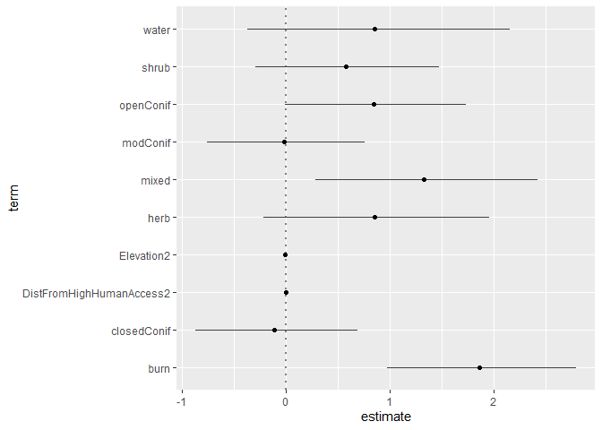<!-- -->

Next, we will subset by packs

``` r
top.env.bv <- glm(used ~ Elevation2 + DistFromHighHumanAccess2 + openConif+modConif+closedConif+mixed+herb+shrub+water+burn, family=binomial(logit), data=wolfkde3, subset=pack== "Bow Valley")
pander(summary(top.env.bv))
```

|                              |  Estimate  | Std. Error | z value | Pr(\>\|z\|) |
|:----------------------------:|:----------:|:----------:|:-------:|:-----------:|
|       **(Intercept)**        |   16.94    |   1.842    |  9.195  |  3.746e-20  |
|        **Elevation2**        |  -0.0116   |  0.001266  | -9.158  |  5.288e-20  |
| **DistFromHighHumanAccess2** | -0.0007834 | 0.0003641  | -2.152  |   0.03143   |
|        **openConif**         |   0.1722   |   0.6188   | 0.2782  |   0.7808    |
|         **modConif**         |  -0.09326  |   0.5416   | -0.1722 |   0.8633    |
|       **closedConif**        |   0.4212   |   0.5824   | 0.7232  |   0.4696    |
|          **mixed**           |   0.5665   |   0.6536   | 0.8669  |    0.386    |
|           **herb**           |   0.5651   |   0.7075   | 0.7987  |   0.4244    |
|          **shrub**           |   0.2972   |   0.6317   | 0.4704  |   0.6381    |
|          **water**           |   0.7625   |   0.7857   | 0.9705  |   0.3318    |
|           **burn**           |    2.36    |   0.825    |  2.861  |  0.004222   |

(Dispersion parameter for binomial family taken to be 1 )

|                    |                                   |
|:------------------:|:---------------------------------:|
|   Null deviance:   | 1431.3 on 1280 degrees of freedom |
| Residual deviance: | 829.2 on 1270 degrees of freedom  |

``` r
## but subset by packs
top.env.rd <- glm(used ~ Elevation2 + DistFromHighHumanAccess2 + openConif+modConif+closedConif+mixed+herb+shrub+water+burn, family=binomial(logit), data=wolfkde3, subset=pack== "Red Deer")
pander(summary(top.env.rd))
```

|                              | Estimate  | Std. Error | z value  | Pr(\>\|z\|) |
|:----------------------------:|:---------:|:----------:|:--------:|:-----------:|
|       **(Intercept)**        |   4.042   |   1.748    |  2.313   |   0.02074   |
|        **Elevation2**        | -0.003926 |  0.000756  |  -5.193  |  2.064e-07  |
| **DistFromHighHumanAccess2** | 5.166e-05 | 3.835e-05  |  1.347   |   0.1779    |
|        **openConif**         |   2.543   |   0.7146   |  3.558   |  0.0003737  |
|         **modConif**         |   1.174   |   0.7075   |  1.659   |   0.09707   |
|       **closedConif**        |   1.305   |   0.723    |  1.805   |    0.071    |
|          **mixed**           |   3.637   |    1.04    |  3.497   |  0.0004704  |
|           **herb**           |   2.08    |   1.061    |   1.96   |   0.04999   |
|          **shrub**           |   2.077   |   0.7846   |  2.647   |  0.008117   |
|          **water**           |  -12.59   |   689.1    | -0.01827 |   0.9854    |
|           **burn**           |   2.807   |   0.7397   |  3.795   |  0.0001477  |

(Dispersion parameter for binomial family taken to be 1 )

|                    |                                 |
|:------------------:|:-------------------------------:|
|   Null deviance:   | 527.7 on 836 degrees of freedom |
| Residual deviance: | 374.4 on 826 degrees of freedom |

Note that there are lots of differences between packs that we have
already seen before in these well-trodden data. There are many ways for
us to think about modeling differences in resource selection between
wolf packs. Today, we will use this as an introduction to mixed-effects
models with this simple VHF dataset with 2 wolf packs, and then quickly
proceed to more complex GPS data.

How to fit with one model? HEre we will fit our first GLM model with a
random-intercept for each wolf pack, using the R package `lme4` command
`glmer` Learn more about glmer using: `?glmer` and we learn \>Fits a
generalized linear mixed-effects model (GLMM). Both fixed effects and
random effects are specified via the model formula.

The key new part of the lm equation command is specifying the formula to
include the random effects term. In the help file we learn:

> Random-effects terms are distinguished by vertical bars (“\|”)
> separating expressions for design matrices from grouping factors.

### What are they and how are they different from fixed effects?

Not single on consensus on how to describe random effects, and they can
be used for multiple purposes. Instead of estimating coefficients for
each level of such a grouping factor (so-called fixed effects),

- Grouping factor: normally distributed random variables with
  predictions being made for each grouping (instead of estimating
  coefficients for each level of such a grouping factor )
- Accounts for non-independence of multiple measurements are taken from
  a single unit (individual, nest, population, site, etc)
- “Nuisance” variables: influences you need to account for but aren’t
  really that interested in
- Cannot treat continuous variables as random effects
- A lot of smart people say you should have at least 5 levels of a
  categorical variable to treat it as a random effect

### How are they applied to linear regression?

You can have random intercepts, random slopes (coefficients) or both:

*Remember that for this model code: y \~ x, there is a mathematical
formula behind it:* y = intercept + beta1\*value1 (beta1 is the slope,
aka regression coefficeint, or the influence of the covariate) In lm(),
glm(), lmer() code, the intercept is often implied and we don’t have to
explicitly write it in:  
lm(y \~ 1 + x, data = myData)

*Random intercept: The intercept (1) can vary per Individ or Site*

- lmer(y \~ x + (1\|Individ), data = mydata)
- lmer(y \~ x + (1\|Site), data = mydata)
- Can even have two random intercepts:
  - without interaction: lmer(y \~ (1\|Individ) + (1\|Site), data =
    myData)
  - with interaction: lmer(y \~ (1\|Individ) + (1\|Site) +
    (1\|Individ:Site), data = myData)

*Random intercept and slope:*

- lmer(y \~ x + (x\|Individ), data = mydata)
- Remember x is the regression coefficient (direcion and magnitude, aka
  slope)
- lmer(height \~ mass + (mass\|Individ), data = myData)
  - The effect of mass can vary per individual
  - The intercept can vary per individual

*Random slope only:The coefficient can vary per Individ*

- lmer(y \~ x + (-1 + x\|Individ), data = mydata)

**Random slopes need a lot of data!**

``` r
top.env.mixed <- glmer(used~Elevation2 + DistFromHighHumanAccess2 + openConif+modConif+closedConif+mixed+herb+shrub+water+burn+(1|pack), data=wolfkde3,family=binomial(link="logit"))
```

    ## Warning: Some predictor variables are on very different scales: consider
    ## rescaling

    ## Warning in checkConv(attr(opt, "derivs"), opt$par, ctrl = control$checkConv, :
    ## Model failed to converge with max|grad| = 0.912736 (tol = 0.002, component 1)

    ## Warning in checkConv(attr(opt, "derivs"), opt$par, ctrl = control$checkConv, : Model is nearly unidentifiable: very large eigenvalue
    ##  - Rescale variables?;Model is nearly unidentifiable: large eigenvalue ratio
    ##  - Rescale variables?

``` r
summary(top.env.mixed)
```

    ## Generalized linear mixed model fit by maximum likelihood (Laplace
    ##   Approximation) [glmerMod]
    ##  Family: binomial  ( logit )
    ## Formula: used ~ Elevation2 + DistFromHighHumanAccess2 + openConif + modConif +  
    ##     closedConif + mixed + herb + shrub + water + burn + (1 |      pack)
    ##    Data: wolfkde3
    ## 
    ##      AIC      BIC   logLik deviance df.resid 
    ##   1308.5   1376.4   -642.3   1284.5     2106 
    ## 
    ## Scaled residuals: 
    ##     Min      1Q  Median      3Q     Max 
    ## -2.4613 -0.3585 -0.0978 -0.0205 11.9115 
    ## 
    ## Random effects:
    ##  Groups Name        Variance Std.Dev.
    ##  pack   (Intercept) 0.2994   0.5472  
    ## Number of obs: 2118, groups:  pack, 2
    ## 
    ## Fixed effects:
    ##                            Estimate Std. Error z value Pr(>|z|)    
    ## (Intercept)               1.149e+01  1.116e+00  10.291  < 2e-16 ***
    ## Elevation2               -7.683e-03  5.713e-04 -13.450  < 2e-16 ***
    ## DistFromHighHumanAccess2  1.252e-04  3.856e-05   3.248 0.001162 ** 
    ## openConif                 6.621e-01  4.497e-01   1.472 0.140916    
    ## modConif                 -1.381e-01  3.920e-01  -0.352 0.724576    
    ## closedConif              -1.322e-01  4.030e-01  -0.328 0.742896    
    ## mixed                     1.199e+00  5.482e-01   2.187 0.028751 *  
    ## herb                      7.328e-01  5.602e-01   1.308 0.190872    
    ## shrub                     4.547e-01  4.599e-01   0.989 0.322851    
    ## water                     6.873e-01  6.408e-01   1.073 0.283482    
    ## burn                      1.631e+00  4.773e-01   3.417 0.000634 ***
    ## ---
    ## Signif. codes:  0 '***' 0.001 '**' 0.01 '*' 0.05 '.' 0.1 ' ' 1
    ## 
    ## Correlation of Fixed Effects:
    ##             (Intr) Elvtn2 DFHHA2 opnCnf modCnf clsdCn mixed  herb   shrub 
    ## Elevation2  -0.871                                                        
    ## DstFrmHgHA2  0.258 -0.415                                                 
    ## openConif   -0.406  0.149  0.007                                          
    ## modConif    -0.481  0.185  0.030  0.803                                   
    ## closedConif -0.341  0.035  0.092  0.759  0.883                            
    ## mixed       -0.378  0.173 -0.005  0.580  0.677  0.633                     
    ## herb        -0.362  0.162 -0.017  0.564  0.657  0.616  0.478              
    ## shrub       -0.395  0.145 -0.005  0.678  0.786  0.744  0.569  0.553       
    ## water       -0.330  0.154  0.012  0.498  0.583  0.545  0.424  0.411  0.489
    ## burn        -0.330  0.082  0.010  0.641  0.733  0.702  0.526  0.515  0.624
    ##             water 
    ## Elevation2        
    ## DstFrmHgHA2       
    ## openConif         
    ## modConif          
    ## closedConif       
    ## mixed             
    ## herb              
    ## shrub             
    ## water             
    ## burn         0.451
    ## fit warnings:
    ## Some predictor variables are on very different scales: consider rescaling
    ## optimizer (Nelder_Mead) convergence code: 0 (OK)
    ## Model failed to converge with max|grad| = 0.912736 (tol = 0.002, component 1)
    ## Model is nearly unidentifiable: very large eigenvalue
    ##  - Rescale variables?
    ## Model is nearly unidentifiable: large eigenvalue ratio
    ##  - Rescale variables?

Note we got a lot of error messages here including:

    #fit warnings:
    #  Some predictor variables are on very different scales: consider rescaling
    #convergence code: 0
    # Model failed to converge with max|grad| = 0.912625 (tol = 0.001, component 1)
    #Model is nearly unidentifiable: very large eigenvalue
    #- Rescale variables?
    #Model is nearly unidentifiable: large eigenvalue ratio
    #- Rescale variables?

## 1.1 Rescaling variables

The error messages from the fit of the wolf data with a random effect
for pack tells us that we need to rescale our variables. What is
rescaling? In R, the command

    scale(x) 

standardizes the data with respect to the mean and standard deviation of
x. Note the defaults are to center to 0 and scale by dividing the
centered x values by their standard deviation. The new variable has a
mean = 0 and are now expressed in units +/- of standard deviations. This
is a very common/important step in the fitting of GLMM’s. This also has
the direct advantage of being able to now directly compare the
coefficients of continuous covariates in terms of SDs. Finally, not we
do not really ever scale categorical variables. These coefficients are
already expressed in a way that can be compared to each other.

``` r
head(wolfkde3)
```

    ##   deer_w2 moose_w2 elk_w2 sheep_w2 goat_w2 wolf_w2 Elevation2
    ## 1       4        5      5        3       3       5   1766.146
    ## 2       4        4      4        1       3       4   1788.780
    ## 3       4        5      5        4       1       5   1765.100
    ## 4       4        5      5        4       1       5   1742.913
    ## 6       1        1      1        1       4       1   1778.360
    ## 7       4        5      5        4       1       5   1764.313
    ##   DistFromHumanAccess2 DistFromHighHumanAccess2 landcover16 EASTING NORTHING
    ## 1             427.3962                9367.8168           8  580840  5724800
    ## 2             360.5043               10398.5999           2  580000  5724195
    ## 3             283.6648               10296.5167           2  579800  5724800
    ## 4             167.4134                6347.8193           2  583803  5725654
    ## 6             622.6257                 723.7941          13  588573  5728804
    ## 7             373.2101                9331.2403           2  580785  5724966
    ##       pack used usedFactor      habitatType        landcov.f closedConif
    ## 1 Red Deer    1          1            Shrub            Shrub           0
    ## 2 Red Deer    1          1 Moderate Conifer Moderate Conifer           0
    ## 3 Red Deer    1          1 Moderate Conifer Moderate Conifer           0
    ## 4 Red Deer    1          1 Moderate Conifer Moderate Conifer           0
    ## 6 Red Deer    1          1   Burn-Grassland             Burn           0
    ## 7 Red Deer    1          1 Moderate Conifer Moderate Conifer           0
    ##   modConif openConif decid regen mixed herb shrub water rockIce burn alpineHerb
    ## 1        0         0     0     0     0    0     1     0       0    0          0
    ## 2        1         0     0     0     0    0     0     0       0    0          0
    ## 3        1         0     0     0     0    0     0     0       0    0          0
    ## 4        1         0     0     0     0    0     0     0       0    0          0
    ## 6        0         0     0     0     0    0     0     0       0    1          0
    ## 7        1         0     0     0     0    0     0     0       0    0          0
    ##   alpineShrub alpine
    ## 1           0      0
    ## 2           0      0
    ## 3           0      0
    ## 4           0      0
    ## 6           0      0
    ## 7           0      0

``` r
wolfkde3$Elevation2_sc <-scale(wolfkde3$Elevation2)
hist(wolfkde3$Elevation2)
```

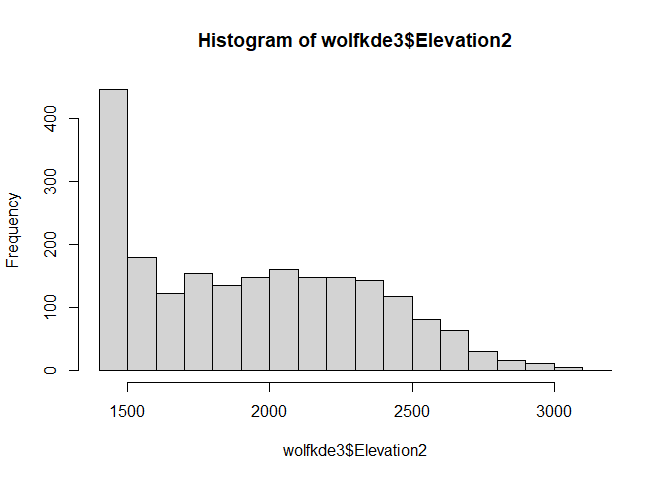<!-- -->

``` r
hist(wolfkde3$Elevation2_sc)
```

<!-- -->

``` r
plot(wolfkde3$Elevation2, wolfkde3$Elevation2_sc)
```

<!-- -->

``` r
summary(wolfkde3$Elevation2)
```

    ##    Min. 1st Qu.  Median    Mean 3rd Qu.    Max. 
    ##    1401    1537    1918    1937    2259    3112

``` r
summary(wolfkde3$Elevation2_sc)
```

    ##        V1          
    ##  Min.   :-1.30701  
    ##  1st Qu.:-0.97482  
    ##  Median :-0.04601  
    ##  Mean   : 0.00000  
    ##  3rd Qu.: 0.78329  
    ##  Max.   : 2.86246

``` r
wolfkde3$DistFromHighHumanAccess2_sc <- scale(wolfkde3$DistFromHighHumanAccess2)
plot(wolfkde3$DistFromHighHumanAccess2, wolfkde3$DistFromHighHumanAccess2_sc, )
```

<!-- --> So we see
that scaling a variable still keeps the exact same relationship between
the original x variable, here elevation or distance (on the X axis) and
the transformed Y variable, which are now reported in units of 1
Standard Deviation.

\*\*Note that when we rescale a covariate, we do so only for that mean
and standard deviation. This gets complicated in multilevel or bayesian
models, or, when we are trying to ‘map’ spatial predictions of a
standardized beta coefficient to a landscape with a different mean and
standard deviation. More on this later.

## Refitting Top Model with Standardized Continuous Data

``` r
top.env2 <- glm(used ~ Elevation2_sc + DistFromHighHumanAccess2_sc + openConif+modConif+closedConif+mixed+herb+shrub+water+burn, family=binomial(logit), data=wolfkde3)
pander(summary(top.env2))
```

|                                 | Estimate | Std. Error | z value  | Pr(\>\|z\|) |
|:-------------------------------:|:--------:|:----------:|:--------:|:-----------:|
|         **(Intercept)**         |  -3.102  |   0.3676   |  -8.439  |  3.192e-17  |
|        **Elevation2_sc**        |  -2.783  |   0.2004   |  -13.89  |  7.445e-44  |
| **DistFromHighHumanAccess2_sc** |  0.6435  |   0.121    |  5.317   |  1.054e-07  |
|          **openConif**          |  0.8457  |   0.4404   |   1.92   |   0.05482   |
|          **modConif**           | -0.01716 |   0.3836   | -0.04473 |   0.9643    |
|         **closedConif**         | -0.1126  |   0.3944   | -0.2856  |   0.7752    |
|            **mixed**            |  1.325   |   0.5435   |  2.438   |   0.01477   |
|            **herb**             |  0.8564  |   0.5525   |   1.55   |   0.1212    |
|            **shrub**            |  0.5781  |   0.4486   |  1.289   |   0.1974    |
|            **water**            |  0.8559  |   0.6389   |   1.34   |   0.1804    |
|            **burn**             |  1.861   |   0.4629   |  4.021   |   5.8e-05   |

(Dispersion parameter for binomial family taken to be 1 )

|                    |                                 |
|:------------------:|:-------------------------------:|
|   Null deviance:   | 2041 on 2117 degrees of freedom |
| Residual deviance: | 1298 on 2107 degrees of freedom |

Note that the beta coefficients are now being reported, for continuous
covariates, in terms of standard deviation units. So we would say that
for every increase of 1 standard deviation of elevation, the logit beta
coefficient changes by - -2.783. Note we have to remember what a
standard deviation in elevation is:

``` r
sd(wolfkde3$Elevation2)
```

    ## [1] 410.279

So for every 410 m increase in elevation, the odds of wolf use change by

``` r
exp(top.env2$coefficients[2])
```

    ## Elevation2_sc 
    ##    0.06187922

So, the odds decrease by a lot, 94%, when you increase by 410 m.
EXCERCISE: Go back and calcualte this manually for 400m to check if this
makes sense.

One major advantage of standardized covariates, and coefficients, is
that now you can directly compare the coefficients of Elevation and
Distance from high human access? Which one has a ‘stronger’ effect?
Elevation. Comparing the categorical landcover coefficients, which one
is the strongest ? (burn)

How now do we fit with one model with our standardized covariates and
avoid the nastygram from R earlier?

``` r
top.env.mixed2 <- glmer(used~Elevation2_sc + DistFromHighHumanAccess2_sc + openConif+modConif+closedConif+mixed+herb+shrub+water+burn+(1|pack), data=wolfkde3,family=binomial(link="logit"))
summary(top.env.mixed2)
```

    ## Generalized linear mixed model fit by maximum likelihood (Laplace
    ##   Approximation) [glmerMod]
    ##  Family: binomial  ( logit )
    ## Formula: used ~ Elevation2_sc + DistFromHighHumanAccess2_sc + openConif +  
    ##     modConif + closedConif + mixed + herb + shrub + water + burn +  
    ##     (1 | pack)
    ##    Data: wolfkde3
    ## 
    ##      AIC      BIC   logLik deviance df.resid 
    ##   1308.5   1376.4   -642.3   1284.5     2106 
    ## 
    ## Scaled residuals: 
    ##     Min      1Q  Median      3Q     Max 
    ## -2.4613 -0.3585 -0.0978 -0.0205 11.9121 
    ## 
    ## Random effects:
    ##  Groups Name        Variance Std.Dev.
    ##  pack   (Intercept) 0.2994   0.5472  
    ## Number of obs: 2118, groups:  pack, 2
    ## 
    ## Fixed effects:
    ##                             Estimate Std. Error z value Pr(>|z|)    
    ## (Intercept)                  -3.0829     0.5424  -5.684 1.31e-08 ***
    ## Elevation2_sc                -3.1523     0.2337 -13.490  < 2e-16 ***
    ## DistFromHighHumanAccess2_sc   0.4316     0.1326   3.254 0.001137 ** 
    ## openConif                     0.6622     0.4496   1.473 0.140785    
    ## modConif                     -0.1381     0.3918  -0.352 0.724607    
    ## closedConif                  -0.1321     0.4026  -0.328 0.742876    
    ## mixed                         1.1990     0.5481   2.187 0.028708 *  
    ## herb                          0.7329     0.5602   1.308 0.190744    
    ## shrub                         0.4548     0.4599   0.989 0.322699    
    ## water                         0.6873     0.6406   1.073 0.283292    
    ## burn                          1.6309     0.4772   3.418 0.000632 ***
    ## ---
    ## Signif. codes:  0 '***' 0.001 '**' 0.01 '*' 0.05 '.' 0.1 ' ' 1
    ## 
    ## Correlation of Fixed Effects:
    ##             (Intr) Elvt2_ DFHHA2 opnCnf modCnf clsdCn mixed  herb   shrub 
    ## Elevatn2_sc  0.170                                                        
    ## DstFrmHHA2_ -0.131 -0.409                                                 
    ## openConif   -0.529  0.152  0.000                                          
    ## modConif    -0.605  0.189  0.023  0.802                                   
    ## closedConif -0.614  0.038  0.085  0.759  0.883                            
    ## mixed       -0.425  0.175 -0.009  0.580  0.677  0.633                     
    ## herb        -0.416  0.164 -0.021  0.564  0.657  0.616  0.477              
    ## shrub       -0.516  0.148 -0.012  0.678  0.786  0.743  0.568  0.553       
    ## water       -0.364  0.156  0.008  0.498  0.583  0.545  0.424  0.411  0.488
    ## burn        -0.509  0.084  0.004  0.641  0.733  0.702  0.526  0.514  0.624
    ##             water 
    ## Elevatn2_sc       
    ## DstFrmHHA2_       
    ## openConif         
    ## modConif          
    ## closedConif       
    ## mixed             
    ## herb              
    ## shrub             
    ## water             
    ## burn         0.451

See! - nasty error messages are gone.

## 1.2 Interpreting Random Effects

Now we can also discuss how to interpret the random effects terms. We
are now given a variance and standard deviation for the Random effect
(here, pack). This is reported in units of standard deviations, which is
another nice reason to standardize continuous (and categorical)
covariates. Here, we can interpre that there is a substantially STRONGER
response by wolves to elevation than individual level variability. i.e.,
Beta-elevation = -3.152, and St.Dev wolf = 0.5472, or about 5.7 times
stronger response to elevation than individual wolf pack variation.

Contrast that with the comparison of St.Dev (pack) to the coefficient
for Distance from High Human Access = 0.4316. This tells us that while
most wolf packs avoided high human activity, there was more variation
between packs in this response than the response. This tells us
something about the variability in pack-level responses to human
activity.

Which is best from an AIC perspective?

``` r
AIC(top.env2, top.env.mixed2, top.env.rd, top.env.bv)
```

    ## Warning in AIC.default(top.env2, top.env.mixed2, top.env.rd, top.env.bv): models
    ## are not all fitted to the same number of observations

    ##                df       AIC
    ## top.env2       11 1320.2833
    ## top.env.mixed2 12 1308.5431
    ## top.env.rd     11  396.4251
    ## top.env.bv     11  851.1538

Warning message: In AIC.default(top.env, top.env.mixed, top.env.rd,
top.env.bv) : models are not all fitted to the same number of
observations

Note that we get this error message because top.env.rd and top.env.bv
are fit with only subsets of the data. However, recall that for 1
dataset, AIC and LL is additive. Thus, the ‘additive’ AIC of the two
‘separate’ models is 396.4251 + 851.1538 = 1247.58 which is
substantively better than the mixed effect model.

Either way, comparing the fixed-effect versus the mixed-effect model, we
can see that the glmm is far better. However, a simpler model with two
separate models, one for each wolf pack, explained the dataset better.
But in practice, we would almost never fit a model with just 2 levels of
a random effect, so now we will go to a more ‘sensible’ dataset.

# Mixed-effects Models with Migrant Elk

Yeah! we will analyze some data besides the now very tired wolf data. We
will use elk GPS collar data from migratory elk in our long-term Ya Ha
Tinda elk study system. These data are based on:

Hebblewhite, M., and E. H. Merrill. 2009. Trade-offs between predation
risk and forage differ between migrant strategies in a migratory
ungulate. Ecology 90:3445-3454.

and the data are available ‘free’ here:

Hebblewhite, M., and E. H. Merrill. 2016. Data from: A multi-scale test
of the forage maturation hypothesis in a partially migratory ungulate
population. Movebank Data Repository. Movebank Data Repository.


For background, trade-offs between predation risk and forage
fundamentally drive resource selection by animals. Among migratory
ungulates, trade-offs can occur at large spatial scales through
migration, which allows an ‘‘escape’’ from predation, but trade-offs can
also occur at finer spatial scales. Previous authors suggest that
ungulates will avoid predation risk at the largest scale, although few
studies have examined multi-scale trade-offs to test for the relative
benefits of risk avoidance across scales. Building on previously
developed spatial models of forage and wolf predation risk, we tested
for trade-offs at the broad landscape scale and at a finer,
within-home-range scale for migratory and non-migratory resident elk
(Cervus candansis) during summer in the Canadian Rockies in Banff
National Park (BNP) and adjacent Alberta, Canada.

## 2.1 Exploring and managing data

``` r
# Bring in data
elk <- read.table("Data/lab7_elk_migrant.csv", header=TRUE, sep=",", na.strings="NA", dec=".", strip.white=TRUE)
head(elk)
```

    ##     idn used elkuid migrant migcode year daynight Night season bioseason
    ## 1 26540    1     73 Migrant       1 2004    Night     1 summer       s04
    ## 2 16500    1     78 Migrant       1 2004    Night     1 summer       s04
    ## 3 18228    1     78 Migrant       1 2004    Night     1 summer       s04
    ## 4 12199    1     96 Migrant       1 2004      Day     0 summer       s04
    ## 5 16259    1     73 Migrant       1 2004    Night     1 summer       s04
    ## 6 11820    1     59 Migrant       1 2004      Day     0 summer       s04
    ##       utmx    utmy elevgis slope northsl flatslo southsl caspv v23 celev v25
    ## 1 544112.8 5714053    1950 29.21       1       0       0     2  10     4  12
    ## 2 558758.5 5703733    2169 21.64       0       0       1     5  10     3  10
    ## 3 559644.9 5699787    1922 17.14       0       0       1     3  10     3  11
    ## 4 573832.5 5741766    2136 26.29       0       0       1     3  10     4  10
    ## 5 545251.9 5713114    1858 15.60       1       0       0     2  10     3  11
    ## 6 573836.3 5741912    2186 22.70       0       0       1     3  10     4  10
    ##   hshade2 wetness green distdiv landcov   landtype totalshrub totalforb
    ## 1      72   10.27     9    3.82       8     Shrubs          0        53
    ## 2     217   10.67    10    9.51       8     Shrubs        415        56
    ## 3     210   10.28     9    9.96       8     Shrubs        425        53
    ## 4     240   10.76     9   44.31       7 Herbaceous        227        63
    ## 5     130   10.85     9    3.86       8     Shrubs        484        49
    ## 6     235   10.56     9   44.42       7 Herbaceous        229        64
    ##   totalherb   ctotrisk ctotrisk2 riskforage for2    risk2
    ## 1        91 0.00037744  1.42e-07  0.0343470 8281 1.42e-07
    ## 2        90 0.00088534  7.84e-07  0.0796803 8100 7.84e-07
    ## 3        91 0.00093215  8.69e-07  0.0848261 8281 8.69e-07
    ## 4        91 0.00095381  9.10e-07  0.0867966 8281 9.10e-07
    ## 5        89 0.00064756  4.19e-07  0.0576325 7921 4.19e-07
    ## 6        90 0.00111038  1.23e-06  0.0999344 8100 1.23e-06

``` r
elk$elkuidF <- as.factor(elk$elkuid)

# get to know our data
table(elk$elkuid, elk$year)
```

    ##      
    ##       2002 2003 2004
    ##   2      0 1328    0
    ##   5      0  698    0
    ##   25     0  944    0
    ##   29     0  842    0
    ##   42     0 1313    0
    ##   56     0    0  417
    ##   59     0    0  928
    ##   73     0    0 1373
    ##   74     0    0 1197
    ##   78     0    0  903
    ##   90     0    0  316
    ##   92     0    0 1390
    ##   93     0    0 1453
    ##   94     0    0 1324
    ##   96     0    0 1399
    ##   104    0    0 1388
    ##   196  141    0    0

``` r
table(elk$elkuid, elk$used)
```

    ##      
    ##          0    1
    ##   2   2398 1328
    ##   5    538  698
    ##   25  2372  944
    ##   29  3711  842
    ##   42   939 1313
    ##   56   729  417
    ##   59   284  928
    ##   73   468 1373
    ##   74  1432 1197
    ##   78   211  903
    ##   90    52  316
    ##   92   485 1390
    ##   93   884 1453
    ##   94   766 1324
    ##   96  1997 1399
    ##   104 1247 1388
    ##   196  112  141

Get to know our data graphically

``` r
ggplot(elk, aes(x=utmx, y = utmy, color = elkuidF)) + geom_point()
```

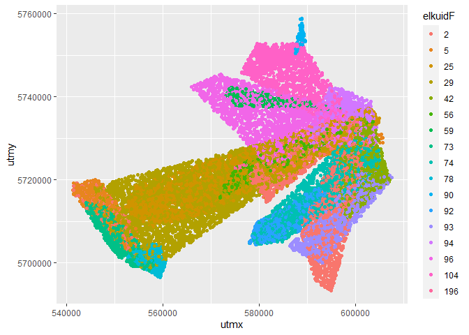<!-- --> Next, how
about ‘just’ the telemetry locations?

``` r
elk.used <- subset(elk, elk$used == 1)
ggplot(elk.used, aes(x=utmx, y = utmy, color = elkuidF)) + geom_point()
```

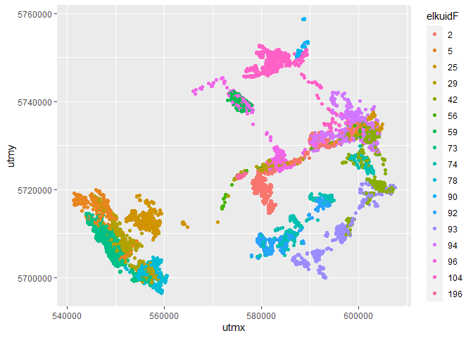<!-- -->

``` r
write.csv(elk.used, "Data/lab8_elk_migrant_used.csv")  ## we might want to use this later, like in Lab 8
```

What kind of sampling design and scale is this?

So there are some data from 2003, most from 2004, 1 elk from 2002. And
there is wide variation in the number of used and available locations
for each elk from 52 (elk 90 0’s) to 3711 (elk 29 0’s). Any guess why
there is variation in the number of 0’s? Home range size: \# of
locations was based on an areal basis.

Today, we are going to be conducting an RSF as a function of Forage
Biomass (totalherb) and wolf predation risk (ctotrisk). Lets look at
these two variables and get to know them.

``` r
hist(elk$ctotrisk)
```

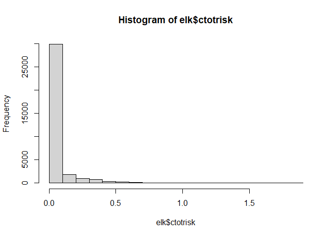<!-- -->

``` r
hist(log(elk$ctotrisk))
```

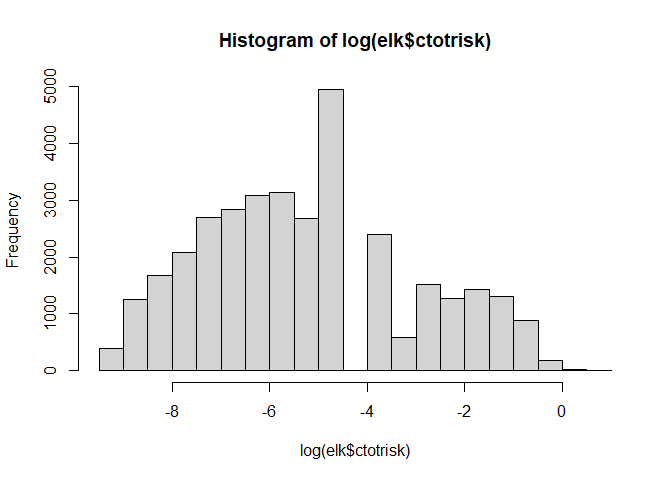<!-- -->

``` r
summary(elk[,30:31]) ## So 1579 NA's predation risk values, and 11 NA's for total herbaceous vegetation
```

    ##    totalherb         ctotrisk     
    ##  Min.   :  0.00   Min.   :0.0001  
    ##  1st Qu.:  0.00   1st Qu.:0.0010  
    ##  Median : 11.00   Median :0.0041  
    ##  Mean   : 20.36   Mean   :0.0470  
    ##  3rd Qu.: 28.00   3rd Qu.:0.0200  
    ##  Max.   :224.00   Max.   :1.8900  
    ##  NA's   :11       NA's   :1579

``` r
length(elk$ctotrisk)
```

    ## [1] 35979

So we need to subset dataset for complete.cases where there are no NA
data - why is this important? How can we compare models using AIC with
different number of rows?

``` r
elk2 <- elk[complete.cases(elk[30:31]), ]
summary(elk2)
```

    ##       idn             used            elkuid         migrant         
    ##  Min.   :    1   Min.   :0.0000   Min.   :  2.00   Length:34390      
    ##  1st Qu.:14900   1st Qu.:0.0000   1st Qu.: 29.00   Class :character  
    ##  Median :27777   Median :0.0000   Median : 73.00   Mode  :character  
    ##  Mean   :32498   Mean   :0.4956   Mean   : 59.82                     
    ##  3rd Qu.:47834   3rd Qu.:1.0000   3rd Qu.: 93.00                     
    ##  Max.   :76102   Max.   :1.0000   Max.   :196.00                     
    ##                                                                      
    ##     migcode       year         daynight             Night      
    ##  Min.   :1   Min.   :2002    Length:34390       Min.   :0.000  
    ##  1st Qu.:1   1st Qu.:2003    Class :character   1st Qu.:0.000  
    ##  Median :1   Median :2004    Mode  :character   Median :0.000  
    ##  Mean   :1   Mean   :2004                       Mean   :0.451  
    ##  3rd Qu.:1   3rd Qu.:2004                       3rd Qu.:1.000  
    ##  Max.   :1   Max.   :2004                       Max.   :1.000  
    ##              NA's   :17346                                     
    ##     season           bioseason              utmx             utmy        
    ##  Length:34390       Length:34390       Min.   :541527   Min.   :5693412  
    ##  Class :character   Class :character   1st Qu.:572150   1st Qu.:5711678  
    ##  Mode  :character   Mode  :character   Median :583955   Median :5721021  
    ##                                        Mean   :581250   Mean   :5722497  
    ##                                        3rd Qu.:596105   3rd Qu.:5732660  
    ##                                        Max.   :607515   Max.   :5757673  
    ##                                                                          
    ##     elevgis         slope          northsl          flatslo       
    ##  Min.   :1531   Min.   : 0.00   Min.   :0.0000   Min.   :0.00000  
    ##  1st Qu.:1765   1st Qu.: 5.78   1st Qu.:0.0000   1st Qu.:0.00000  
    ##  Median :2026   Median :13.94   Median :0.0000   Median :0.00000  
    ##  Mean   :2028   Mean   :15.21   Mean   :0.4477   Mean   :0.09889  
    ##  3rd Qu.:2258   3rd Qu.:23.34   3rd Qu.:1.0000   3rd Qu.:0.00000  
    ##  Max.   :3307   Max.   :60.26   Max.   :1.0000   Max.   :1.00000  
    ##                                                                   
    ##     southsl           caspv             v23             celev      
    ##  Min.   :0.0000   Min.   : 1.000   Min.   : 5.000   Min.   :1.000  
    ##  1st Qu.:0.0000   1st Qu.: 3.000   1st Qu.:10.000   1st Qu.:2.000  
    ##  Median :0.0000   Median : 5.000   Median :10.000   Median :3.000  
    ##  Mean   :0.4534   Mean   : 4.877   Mean   : 9.935   Mean   :2.923  
    ##  3rd Qu.:1.0000   3rd Qu.: 7.000   3rd Qu.:10.000   3rd Qu.:4.000  
    ##  Max.   :1.0000   Max.   :10.000   Max.   :10.000   Max.   :9.000  
    ##                                                                    
    ##       v25            hshade2       wetness          green          distdiv     
    ##  Min.   : 2.000   Min.   :  0   Min.   : 6.51   Min.   : 1.00   Min.   : 1.34  
    ##  1st Qu.: 7.000   1st Qu.:155   1st Qu.: 9.22   1st Qu.: 6.00   1st Qu.:30.04  
    ##  Median : 9.000   Median :180   Median :10.17   Median : 7.00   Median :43.78  
    ##  Mean   : 8.328   Mean   :175   Mean   :10.64   Mean   : 6.65   Mean   :39.05  
    ##  3rd Qu.:10.000   3rd Qu.:202   3rd Qu.:11.40   3rd Qu.: 8.00   3rd Qu.:54.88  
    ##  Max.   :17.000   Max.   :254   Max.   :27.29   Max.   :10.00   Max.   :66.06  
    ##                                                                                
    ##     landcov         landtype           totalshrub      totalforb     
    ##  Min.   : 1.000   Length:34390       Min.   :  0.0   Min.   :  0.00  
    ##  1st Qu.: 2.000   Class :character   1st Qu.:  0.0   1st Qu.:  4.00  
    ##  Median : 7.000   Mode  :character   Median :134.0   Median : 15.00  
    ##  Mean   : 6.871                      Mean   :152.1   Mean   : 19.81  
    ##  3rd Qu.:10.000                      3rd Qu.:248.0   3rd Qu.: 27.00  
    ##  Max.   :16.000                      Max.   :724.0   Max.   :152.00  
    ##                                      NA's   :17346   NA's   :17346   
    ##    totalherb         ctotrisk           ctotrisk2          riskforage       
    ##  Min.   :  0.00   Min.   :0.0001000   Min.   :0.000000   Min.   :  0.00000  
    ##  1st Qu.:  0.00   1st Qu.:0.0009938   1st Qu.:0.000001   1st Qu.:  0.00000  
    ##  Median : 12.00   Median :0.0041379   Median :0.000017   Median :  0.03783  
    ##  Mean   : 21.09   Mean   :0.0469646   Mean   :0.015396   Mean   :  1.96913  
    ##  3rd Qu.: 29.00   3rd Qu.:0.0200000   3rd Qu.:0.000400   3rd Qu.:  0.38577  
    ##  Max.   :224.00   Max.   :1.8900000   Max.   :3.572100   Max.   :138.32000  
    ##                                                                             
    ##       for2           risk2             elkuidF     
    ##  Min.   :    0   Min.   :0.000000   29     : 4174  
    ##  1st Qu.:    0   1st Qu.:0.000001   2      : 3539  
    ##  Median :  144   Median :0.000017   96     : 3196  
    ##  Mean   : 1131   Mean   :0.015396   25     : 3183  
    ##  3rd Qu.:  841   3rd Qu.:0.000400   104    : 2579  
    ##  Max.   :50176   Max.   :3.572100   74     : 2529  
    ##                                     (Other):15190

``` r
length(elk2$ctotrisk)
```

    ## [1] 34390

Next, we still need to clean up predation risk data being predicted \> 1

``` r
elk2$ctotrisk[elk2$ctotrisk>1]=1
table(elk2$elkuid, elk2$year)
```

    ##      
    ##       2002 2003 2004
    ##   2      0 1328    0
    ##   5      0  688    0
    ##   25     0  924    0
    ##   29     0  840    0
    ##   42     0 1313    0
    ##   56     0    0  417
    ##   59     0    0  925
    ##   73     0    0 1241
    ##   74     0    0 1195
    ##   78     0    0  896
    ##   90     0    0  198
    ##   92     0    0 1378
    ##   93     0    0 1453
    ##   94     0    0 1324
    ##   96     0    0 1397
    ##   104    0    0 1386
    ##   196  141    0    0

``` r
table(elk2$elkuid, elk2$used)
```

    ##      
    ##          0    1
    ##   2   2211 1328
    ##   5    510  688
    ##   25  2259  924
    ##   29  3334  840
    ##   42   913 1313
    ##   56   725  417
    ##   59   243  925
    ##   73   437 1241
    ##   74  1334 1195
    ##   78   203  896
    ##   90    42  198
    ##   92   466 1378
    ##   93   799 1453
    ##   94   766 1324
    ##   96  1799 1397
    ##   104 1193 1386
    ##   196  112  141

``` r
# Compute sample size for each elk
n = tapply(elk$idn, elk$elkuid,length)
n
```

    ##    2    5   25   29   42   56   59   73   74   78   90   92   93   94   96  104 
    ## 3726 1236 3316 4553 2252 1146 1212 1841 2629 1114  368 1875 2337 2090 3396 2635 
    ##  196 
    ##  253

Next, lets calculate mean wolf predation risk

``` r
wolf = tapply(na.omit(elk2$ctotrisk), elk2$elkuid[which((elk2$ctotrisk!="NA")==TRUE)],mean)
wolf
```

    ##            2            5           25           29           42           56 
    ## 0.0778728331 0.0114242478 0.0551941567 0.0410911816 0.0414572404 0.1280973679 
    ##           59           73           74           78           90           92 
    ## 0.0025127583 0.0016995864 0.0375634085 0.0015819426 0.0009772592 0.0438023751 
    ##           93           94           96          104          196 
    ## 0.0054958079 0.1224840648 0.0465707038 0.0197130435 0.3177843021

``` r
hist(wolf)
```

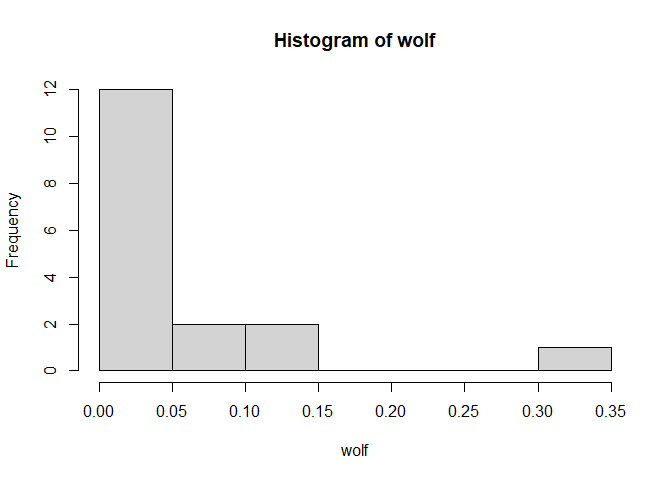<!-- --> This shows a
wide variation in the exposure of elk to wolf predation risk.

``` r
forage = tapply(na.omit(elk2$totalherb), elk$elkuid[which((elk2$totalherb!="NA")==TRUE)],mean)
forage
```

    ##        2        5       25       29       42       56       59       73 
    ## 17.67354 12.64315 13.81882 11.29948 20.69169 29.69594 20.90383 25.48031 
    ##       74       78       90       92       93       94       96      104 
    ## 20.65224 24.12918 23.65015 21.56490 27.80511 47.33946 20.64337 22.36901 
    ##      196 
    ## 19.67089

``` r
hist(forage)
```

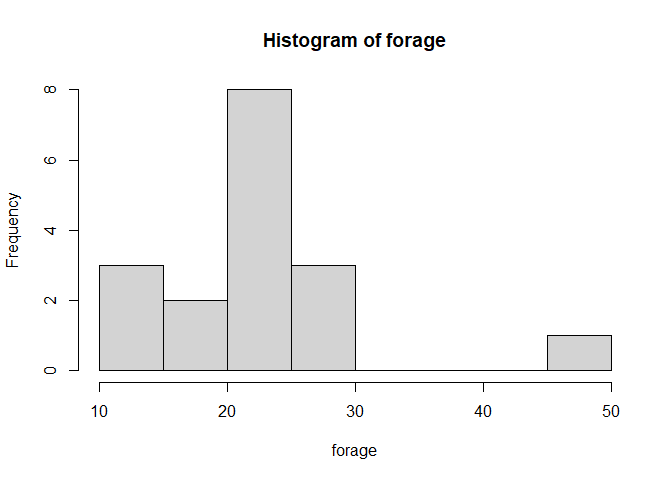<!-- --> And quite a
bit of variation, but not as much - absolutely - in the exposure to
forage biomass (again, reported as g/m^2).

## 2.1 Scaling risk and forage

Following the above, we recall that to fit GLMM we will always need to
center and scale (scale) variables to make estimation efficient.

``` r
elk2$totalherb_sc <- scale(elk2$totalherb)
elk2$ctotrisk_sc <- scale(elk2$ctotrisk)
elk2$ctotrisk2_sc <- scale(elk2$ctotrisk2)
elk2$riskforage_sc <- scale(elk2$riskforage)
elk2$for2_sc <- scale(elk2$for2)
elk2$risk2_sc <- scale(elk2$risk2)

##### AGain, just to double check what scale is doing
plot(elk2$ctotrisk_sc, elk2$ctotrisk)
```

<!-- -->

## Fitting Standard Fixed-Effects Model and Understanding Ecology

First, we are going to explore the straight forward RSF using the model
from the Hebblewhite & Merrill (2009) paper discussed in class where
migrant elk make trade-offs between risk and forage at the home range
scale, as well as their interaction between risk and forage. We are not
going to concern ourselves with model selection questions in this lab,
but instead consider elk resource selection to be a function of wolf
predation risk, total herbaceous forage biomass (g/m2) and their
interaction.

``` r
# Fitting best model(s)
forage = glm(used~totalherb, data=elk2,family=binomial(link="logit"))
risk = glm(used~ctotrisk, data=elk2,family=binomial(link="logit"))
forANDrisk = glm(used~totalherb+ctotrisk, data=elk2,family=binomial(link="logit"))
forrisk = glm(used~totalherb+ctotrisk+ctotrisk*totalherb, data=elk2,family=binomial(link="logit"))

AIC(forage, risk, forANDrisk, forrisk)
```

    ##            df      AIC
    ## forage      2 42568.69
    ## risk        2 47525.47
    ## forANDrisk  3 42428.53
    ## forrisk     4 42215.78

So, the best model from AIC perspective is forrisk

``` r
summary(forrisk)
```

    ## 
    ## Call:
    ## glm(formula = used ~ totalherb + ctotrisk + ctotrisk * totalherb, 
    ##     family = binomial(link = "logit"), data = elk2)
    ## 
    ## Deviance Residuals: 
    ##     Min       1Q   Median       3Q      Max  
    ## -4.0397  -0.9646  -0.8637   1.0778   1.5279  
    ## 
    ## Coefficients:
    ##                      Estimate Std. Error z value Pr(>|z|)    
    ## (Intercept)        -0.7938903  0.0167247 -47.468  < 2e-16 ***
    ## totalherb           0.0450247  0.0007724  58.290  < 2e-16 ***
    ## ctotrisk            0.4855086  0.1622428   2.992  0.00277 ** 
    ## totalherb:ctotrisk -0.0589087  0.0037465 -15.724  < 2e-16 ***
    ## ---
    ## Signif. codes:  0 '***' 0.001 '**' 0.01 '*' 0.05 '.' 0.1 ' ' 1
    ## 
    ## (Dispersion parameter for binomial family taken to be 1)
    ## 
    ##     Null deviance: 47672  on 34389  degrees of freedom
    ## Residual deviance: 42208  on 34386  degrees of freedom
    ## AIC: 42216
    ## 
    ## Number of Fisher Scoring iterations: 4

``` r
ggcoef(forrisk, exclude_intercept = TRUE)
```

<!-- -->

Ecologically, what does this model say to us? There is some intercept,
which we now now is fundamentally related to the sampling fraction of
used : available locations, so we don’t pay it much attention. We see
that the probability of elk use increases with increasing forage biomass
(B-totalherb = 0.045), increases with increasing predation risk
(B-ctotrisk = 0.48) - which at first is a bit puzzling. Why would elk
select areas of higher predation risk? But then we note the very strong
effect of the NEGATIVE interaction between total predation risk and
herbaceous biomass (B-f\*p = -0.059). A negative interaction is
logically interpreted as reduced probabiltiy of elk use with increasing
forage and/or predation. But interpreting an interaction in a logistic
regression model of any kind is complicated. We will graph this later.

## Refit top model with scaled

Now we will refit the same model wtih scaled coefficients, that makes
comparing the coefficients easier, though we note that the Z-values and
P-values remain nearly identical.

``` r
forrisk_sc = glm(used~totalherb_sc+ctotrisk_sc+ctotrisk_sc*totalherb_sc, data=elk2,family=binomial(link="logit"))
summary(forrisk_sc)
```

    ## 
    ## Call:
    ## glm(formula = used ~ totalherb_sc + ctotrisk_sc + ctotrisk_sc * 
    ##     totalherb_sc, family = binomial(link = "logit"), data = elk2)
    ## 
    ## Deviance Residuals: 
    ##     Min       1Q   Median       3Q      Max  
    ## -4.0397  -0.9646  -0.8637   1.0778   1.5279  
    ## 
    ## Coefficients:
    ##                          Estimate Std. Error z value Pr(>|z|)    
    ## (Intercept)               0.12031    0.01269   9.483  < 2e-16 ***
    ## totalherb_sc              1.10718    0.01828  60.565  < 2e-16 ***
    ## ctotrisk_sc              -0.08504    0.01321  -6.439  1.2e-10 ***
    ## totalherb_sc:ctotrisk_sc -0.17336    0.01103 -15.724  < 2e-16 ***
    ## ---
    ## Signif. codes:  0 '***' 0.001 '**' 0.01 '*' 0.05 '.' 0.1 ' ' 1
    ## 
    ## (Dispersion parameter for binomial family taken to be 1)
    ## 
    ##     Null deviance: 47672  on 34389  degrees of freedom
    ## Residual deviance: 42208  on 34386  degrees of freedom
    ## AIC: 42216
    ## 
    ## Number of Fisher Scoring iterations: 4

``` r
ggcoef(forrisk_sc, exclude_intercept = TRUE)
```

<!-- --> This tells
us the same, but oddly, note that the main effects for predation risk
are now negative, not positive. Question - WHY????

hint:

``` r
hist(elk2$ctotrisk)
```

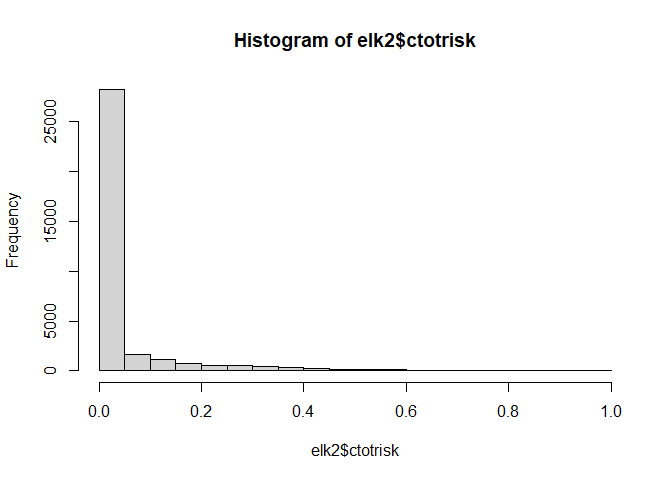<!-- --> What does
centering and scaling do? What is the mean of ctotrisk?

``` r
mean(elk2$ctotrisk)
```

    ## [1] 0.04672939

So, when total predation risk is greater than the mean predation risk,
which is 0 in the scaled model, the effect is that increasing risk here
causes a reduction in elk use. This is rescaled, and the same data as
the unscaled model, but centering and scaling can cause flips in the
signs of coefficients that have to do with the underlying distribution
of the covariate, here, risk, which is VERY right skewed.

Practically, the intepretation will remain exactly the same. But beware
the distribution of the underlying X variables will and can cause
challenges in interpretation of the rescaled beta coefficients. For this
reason, I almost always start with unscaled ‘raw’ data to understand any
potential challenges in interpretation.

## Visualizing the Interaction from the Unstandardized Fixed-effects model

As we have discussed a bit in class, interpreting interactions in ANY
linear model is challenging. Especially binary responses. So, here, we
will visualize the interaction for the rescaled models.

``` r
# Calculate some summary statistics for forage
hist(elk$totalherb)
```

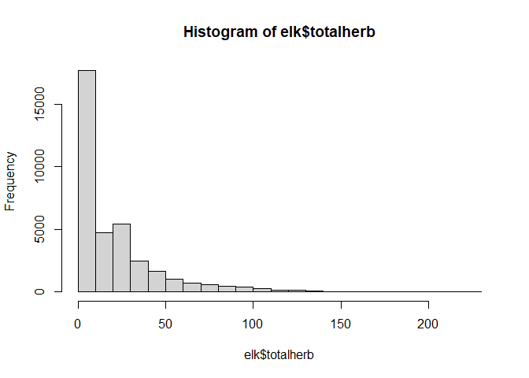<!-- -->

``` r
hist(log(elk$totalherb))
```

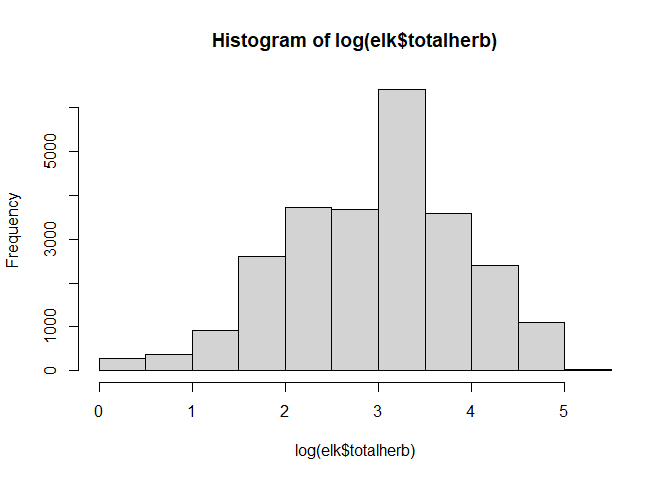<!-- -->

``` r
quantile(elk$totalherb,na.rm=TRUE)
```

    ##   0%  25%  50%  75% 100% 
    ##    0    0   11   28  224

``` r
mean(elk$totalherb,na.rm=TRUE)
```

    ## [1] 20.36407

``` r
herb.lo = 5
herb.med = 15
herb.hi = 50
```

# Make predictions

Now we will make predictions for the top model, forrisk, given these new
data for the low, medium and high levels of forage, and the actual
values of predation risk by wolves.

``` r
predrisk = seq(0,1,0.01)
pred.lo = predict(forrisk,type="response", newdata = data.frame(totalherb=herb.lo, ctotrisk=predrisk))
pred.med = predict(forrisk,type="response", newdata = data.frame(totalherb=herb.med, ctotrisk=predrisk))
pred.hi = predict(forrisk,type="response", newdata = data.frame(totalherb=herb.hi, ctotrisk=predrisk))

# Make plot
plot(elk2$ctotrisk,elk2$used, xlab="Risk", ylab="Pr(Use)")
lines(predrisk,pred.lo, lty=1)
lines(predrisk,pred.med, lty=2)
lines(predrisk,pred.hi, lty=3)
legend(x=0.7,y=0.95, legend=c("Observed","Low Forage","Medium Forage","High Forage"), pch=c(1,rep(-1,3)),lty=c(-1,1:3),bty="n")
```

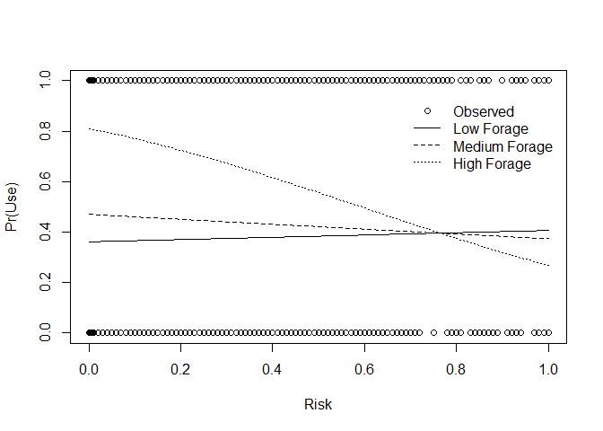<!-- -->

Note here that the effects of wolf predation risk on the Pr(Elk Use)
vary with forage levels. This is the essence of an interaction. We see
that under low forage levels, elk barely respond to wolf predation risk.
Conversely, at higher forage levels, elk SWITCH to avoiding areas of
high predation risk. I wonder why this is? Of course, the answer lies in
what wolves are doing :)

## Visualizing the interactions with ggplot2

I often use ggplot2 to help visual interactions in glm(er) type models.
I first make

``` r
elk2$usedF <- as.factor(elk2$used)
ggplot(elk2, aes(x=ctotrisk, y = used)) + stat_smooth(method="glm", method.args = list(family="binomial"))
```

    ## `geom_smooth()` using formula = 'y ~ x'

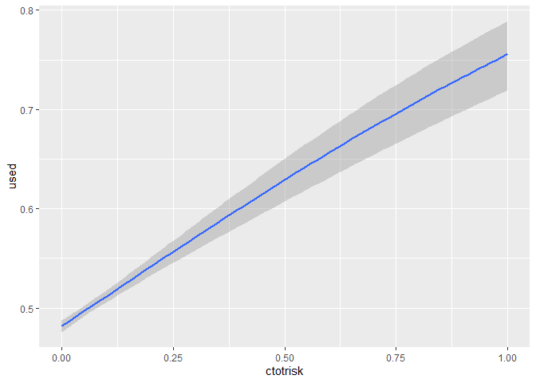<!-- -->

``` r
ggplot(elk2, aes(x=totalherb, y = used)) + stat_smooth(method="glm", method.args = list(family="binomial"))
```

    ## `geom_smooth()` using formula = 'y ~ x'

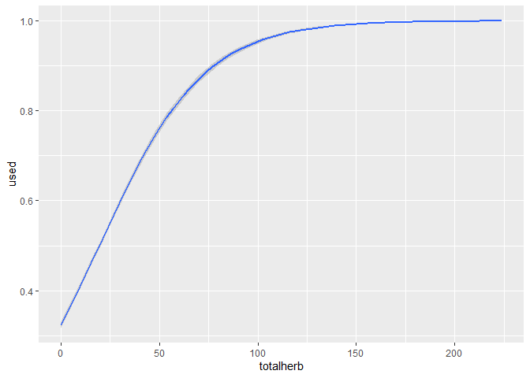<!-- -->

``` r
ggplot(elk2, aes(x=riskforage, y = used)) + geom_rug() + stat_smooth(method="glm", method.args = list(family="binomial"))
```

    ## `geom_smooth()` using formula = 'y ~ x'

<!-- --> But what
does this last plot mean? Need to make a categorical variable at 3
different levels of forage, and then facet or fill by this new variable,
herbaceous forage class.

Note I use the Hmisc package here to split into categories

``` r
elk2$forage.cat  <- as.factor(as.numeric(cut2(elk2$totalherb, g=3)))
elk2$forage.cat  <- cut2(elk2$totalherb, g=3)
ggplot(elk2, aes(x=ctotrisk, y = used, fill = forage.cat)) + stat_smooth(method="glm", method.args = list(family="binomial"))
```

    ## `geom_smooth()` using formula = 'y ~ x'

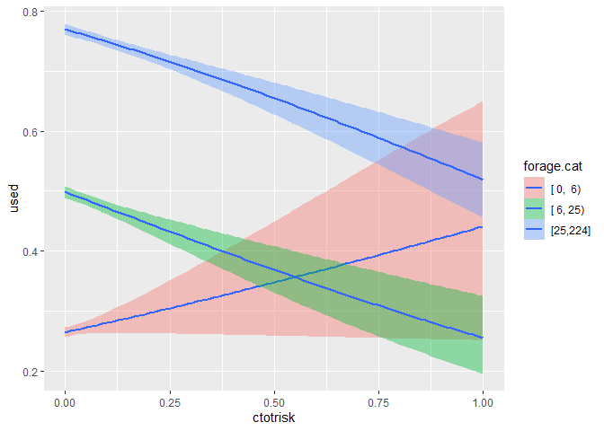<!-- --> note this
plot looks different than the interaction I made above, with mean levels
of 5, 15, and 50. But this is for different classes, and, not just a
fixed level, but the mean value in that category. But it shows the same
trend, that there is a flip in how elk respond to wolf predation risk at
low and moderate to high forage values.

Note we can flip the interaction and view it from the wolf predation
risk perspective.

``` r
elk2$risk.cat  <- cut2(elk2$ctotrisk, g=3)
ggplot(elk2, aes(x=totalherb, y = used, fill = risk.cat)) + stat_smooth(method="glm", method.args = list(family="binomial"))
```

    ## `geom_smooth()` using formula = 'y ~ x'

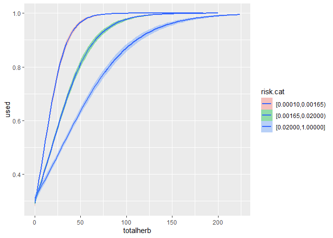<!-- --> Both graphs
show that the effect of the interaction is only really present at low
forage levels when elk select for high predation risk, but otherwise
they select high forage biomass at all times, just less when under high
predation risk. But a key take home point here is to ALWAYS explore
2-way interactions BOTH ways, wihch each variable on the X-axis.

## Visualizing the Marginal Effects with Resource Selection Marginal Effects ‘mep’

This is from the Resource Selection package by Subhash Lele, and is a
nice plot. However, it does not do interactive effects. It is based on
this paper:

Avgar, T., Lele, S. R., Keim, J. L. & Boyce, M. S. (2017) Relative
Selection Strength: Quantifying effect size in habitat- and
step-selection inference. Ecology and Evolution 7, 5322–5330.

``` r
mep(forrisk_sc)
```

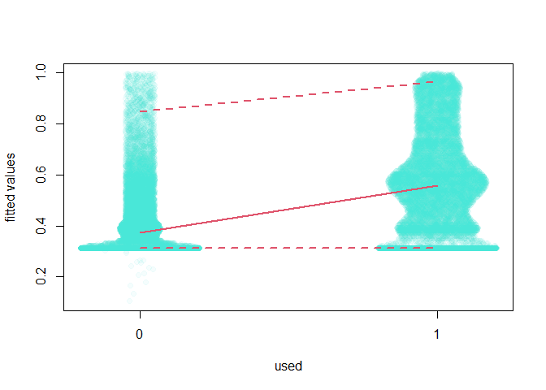<!-- -->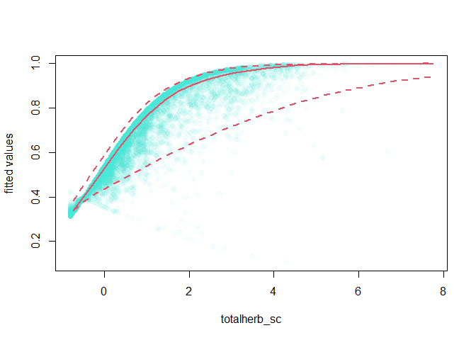<!-- -->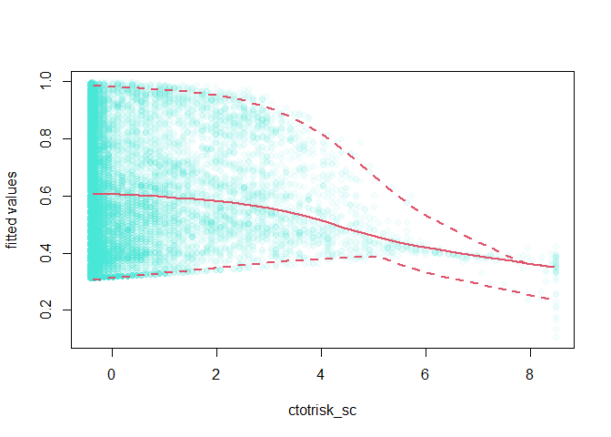<!-- -->

Note, so far, all we have done is explore this model with fixed effects,
and got to understand its ecology. WE have not dealt with the basic
problem so far that there is a lot of unmodeled heterogeneity between
elk in our dataset driven by 3 main things;

1)  Differences between elk in the variance and correlation within elk
    locations (basic assumption of independence of the observations)
2)  Differences between elk in the number of locations simply because of
    sampling (observation process).
3)  Differences between elk in the actual responses to these ecological
    covariates (biological process)

Next, we will explore some basic early approaches to dealing with the
1st problem, unmodeled heterogeneity, using sandwhich estimators.

# Robust Standard Errors with Clustering

This is a demonstration of the Newey-West Sandwhich Estimator - i.e.,
clustering the standard errors taking into account autocorrelation
within an individual elk, Heterskedasticity. All clustering does is
account for the pseudoreplication within sample units, handy yes.

The relevant paper demonstrating it with RSF models is: Nielsen, S. E.,
M. S. Boyce, G. B. Stenhouse, and R. H. Munro. 2002. Modeling grizzly
bear habitats in the Yellowhead ecosystem of Alberta: taking
autocorrelation seriously. Ursus 13:45-56.

This next command vcovHC generates the default heteroskedastic robust
standard errors in R using the cvocHC() function in the sandwhich based
package.

``` r
forrisk2 <-vcovHC(forrisk, elk$elkuid, type = "const", sandwhich = TRUE)
```

    ## Warning in sqrt(omega) * X: longer object length is not a multiple of shorter
    ## object length

``` r
forrisk2
```

    ##                     (Intercept)     totalherb    ctotrisk totalherb:ctotrisk
    ## (Intercept)         0.125299083 -0.0060574616 -0.49719924        0.018132727
    ## totalherb          -0.006057462  0.0004609089  0.01969094       -0.001216543
    ## ctotrisk           -0.497199245  0.0196909374 11.29335541       -0.250270158
    ## totalherb:ctotrisk  0.018132727 -0.0012165426 -0.25027016        0.008529721

``` r
coeftest(forrisk, forrisk2)
```

    ## 
    ## z test of coefficients:
    ## 
    ##                     Estimate Std. Error z value Pr(>|z|)  
    ## (Intercept)        -0.793890   0.353976 -2.2428  0.02491 *
    ## totalherb           0.045025   0.021469  2.0972  0.03597 *
    ## ctotrisk            0.485509   3.360559  0.1445  0.88513  
    ## totalherb:ctotrisk -0.058909   0.092356 -0.6378  0.52358  
    ## ---
    ## Signif. codes:  0 '***' 0.001 '**' 0.01 '*' 0.05 '.' 0.1 ' ' 1

Compare the SE’s that are robust and not robust for comparison but
without a cluster variable. This reports a z-test statistic and
associated P-value for whether there is a difference in the estimate of
the two coefficients from the two models. This is a handy function in
general to test the coefficients from 2 models of any type with the same
structure. Here it tells us that there is a difference in the intercept
(not really that ecologically interesting) and a difference in forage
between the two models. Because the Z-statistic is positive, 0.04 for
totalherb, that tells us that failing to take into account the
‘clustering’ within individuals leads us to overestimate the effect of
forage.

While the Newey-West Sandwhich estimator can help tell you when you have
unmodeled heterogeneity, its generally not recommended when we have
other alternatives present.

# Fixed-effects Models with a Fixed-Effect for Each Individual Elk

Now we will fit a fixed-effects model with a fixed effect intercept for
each individual elk, i.e., with 1 intercept per elk. Note we will use
elkuidF as the factor here.

``` r
forriskFI = glm(used~totalherb+ctotrisk+ctotrisk*totalherb+elkuidF, data=elk,family=binomial(link="logit"))
summary(forriskFI)
```

    ## 
    ## Call:
    ## glm(formula = used ~ totalherb + ctotrisk + ctotrisk * totalherb + 
    ##     elkuidF, family = binomial(link = "logit"), data = elk)
    ## 
    ## Deviance Residuals: 
    ##     Min       1Q   Median       3Q      Max  
    ## -3.7927  -0.8965  -0.5560   0.9489   1.9715  
    ## 
    ## Coefficients:
    ##                      Estimate Std. Error z value Pr(>|z|)    
    ## (Intercept)        -1.1051164  0.0387621 -28.510  < 2e-16 ***
    ## totalherb           0.0391708  0.0008021  48.838  < 2e-16 ***
    ## ctotrisk            1.4461134  0.1727601   8.371  < 2e-16 ***
    ## elkuidF5            0.9896113  0.0703386  14.069  < 2e-16 ***
    ## elkuidF25          -0.2744382  0.0545134  -5.034 4.80e-07 ***
    ## elkuidF29          -0.6838856  0.0539234 -12.683  < 2e-16 ***
    ## elkuidF42           0.6783358  0.0582501  11.645  < 2e-16 ***
    ## elkuidF56          -0.5268584  0.0775606  -6.793 1.10e-11 ***
    ## elkuidF59           1.8831422  0.0836697  22.507  < 2e-16 ***
    ## elkuidF73           1.2534254  0.0689722  18.173  < 2e-16 ***
    ## elkuidF74           0.2151677  0.0567871   3.789 0.000151 ***
    ## elkuidF78           1.7463187  0.0880810  19.826  < 2e-16 ***
    ## elkuidF90           1.8138242  0.1770167  10.247  < 2e-16 ***
    ## elkuidF92           1.5737968  0.0668893  23.528  < 2e-16 ***
    ## elkuidF93           0.7547853  0.0615857  12.256  < 2e-16 ***
    ## elkuidF94           0.1034055  0.0654932   1.579 0.114365    
    ## elkuidF96           0.1119578  0.0534965   2.093 0.036367 *  
    ## elkuidF104          0.3946278  0.0567433   6.955 3.54e-12 ***
    ## elkuidF196          0.5028438  0.1398406   3.596 0.000323 ***
    ## totalherb:ctotrisk -0.0473504  0.0038199 -12.396  < 2e-16 ***
    ## ---
    ## Signif. codes:  0 '***' 0.001 '**' 0.01 '*' 0.05 '.' 0.1 ' ' 1
    ## 
    ## (Dispersion parameter for binomial family taken to be 1)
    ## 
    ##     Null deviance: 47672  on 34389  degrees of freedom
    ## Residual deviance: 38921  on 34370  degrees of freedom
    ##   (1589 observations deleted due to missingness)
    ## AIC: 38961
    ## 
    ## Number of Fisher Scoring iterations: 4

``` r
ggcoef(forriskFI, exclude_intercept = TRUE)
```

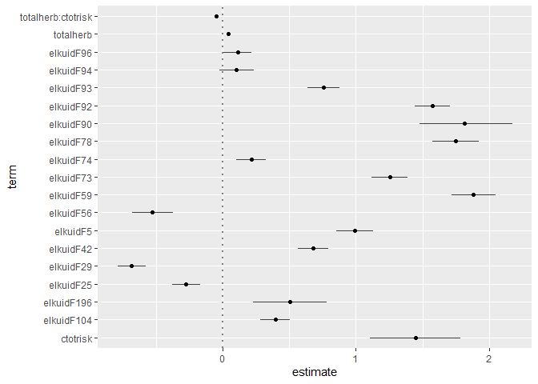<!-- -->

Discussion - what does each coefficient mean in a used-available design?
What is the correspondance between the sampling ratio of used to
available locations and the coefficient?

``` r
table(elk2$elkuid, elk2$used)
```

    ##      
    ##          0    1
    ##   2   2211 1328
    ##   5    510  688
    ##   25  2259  924
    ##   29  3334  840
    ##   42   913 1313
    ##   56   725  417
    ##   59   243  925
    ##   73   437 1241
    ##   74  1334 1195
    ##   78   203  896
    ##   90    42  198
    ##   92   466 1378
    ##   93   799 1453
    ##   94   766 1324
    ##   96  1799 1397
    ##   104 1193 1386
    ##   196  112  141

Check for elk 196, 141/(141+1120) = 0.557; B is 0.502 - close enough in
multiple logit model with continuous covariates.

There is absolutely nothing wrong with using a fixed factor for
individual or groups instead of random effects. Manly chapter 5 covers
this. However, why would we not just want to use this fixed effect?
There are 2 reasons. First, philosophical - having to do with wanting to
make inferences beyond just our radiocollared sample. And second, the
penalty of estimating all these additional coefficients for each
individual elk. See here:

``` r
AIC(forriskFI, forage, risk, forANDrisk, forrisk)
```

    ##            df      AIC
    ## forriskFI  20 38961.48
    ## forage      2 42568.69
    ## risk        2 47525.47
    ## forANDrisk  3 42428.53
    ## forrisk     4 42215.78

The main issue is the greater number of parameters, here, 1 for each
individual elk. But, from an AIC perspective, the fixed-effects of each
individual elk provide a better ‘fit’. But again, remember what the
intercept means in a used-available design.

# Two-Stage Modeling

Next we will explore the ‘poor-mans’ version of mixed-effects models,
somewhere between fitting a fixed-effect for each individual elk and a
full mixed-effect model. While I call it a poor-mans version, it is
honestly the first thing I do with any complex dataset to understand
where the variation where the main sources of variation are coming from.

The best papers to read here are:

Fieberg, J., J. Matthiopoulos, M. Hebblewhite, M. S. Boyce, and J. L.
Frair. 2010. Correlation and studies of habitat selection: problem, red
herring or opportunity? Philosophical Transactions of the Royal Society
B: Biological Sciences 365:2233-2244.,

and

Murtaugh, P. A. 2007. Simplicity and complexity in ecological data
analysis. Ecology 88:56-62. and

Sawyer, H., R. M. Nielson, F. Lindzey, and L. L. Mcdonald. 2006. Winter
Habitat Selection of Mule Deer Before and During Development of a
Natural Gas Field. Journal of Wildlife Management 70:396-403, and

## Fixed Effects Model for Each Individual

The first step I take is to fit one individual model to each individual
elk or sampling unit.

``` r
elkids = sort(unique(elk2$elkuid))
modelnames = paste("elk",elkids)
models = list()

for (i in 1:length(elkids)){
    models[[i]]=glm(used~totalherb_sc+ctotrisk_sc+ctotrisk_sc*totalherb_sc, data=elk2,subset = elkuid==elkids[i], family=binomial(link="logit"))

}
```

    ## Warning: glm.fit: fitted probabilities numerically 0 or 1 occurred

    ## Warning: glm.fit: fitted probabilities numerically 0 or 1 occurred

``` r
names(models)=modelnames
#lapply(models,summary) #### Note I supressed this because it just spits out 17 models, 1 for each elk

# This creates a dataframe with the beta coefficients for each model/elk
coefs = as.data.frame(lapply(models, coef))
coefs
```

    ##                               elk.2      elk.5       elk.25     elk.29
    ## (Intercept)              -0.6869455  -3.688158 -0.829788220 -1.1524225
    ## totalherb_sc             -0.2663299  -3.251812  0.192937628  0.4886864
    ## ctotrisk_sc               0.8316429 -10.532198 -0.008045513  0.2665379
    ## totalherb_sc:ctotrisk_sc -0.3007834  -8.321302  0.026228478 -0.1156154
    ##                              elk.42      elk.56    elk.59     elk.73
    ## (Intercept)               0.6835120 -0.68528659 -19.18118  -9.394086
    ## totalherb_sc              0.3410619  1.48605381  11.49317 -10.666046
    ## ctotrisk_sc               1.2141372 -0.44268097 -52.41802 -27.132288
    ## totalherb_sc:ctotrisk_sc -1.2114773 -0.04525429  24.77480 -37.846209
    ##                               elk.74      elk.78     elk.90      elk.92
    ## (Intercept)              -0.09685491  -7.7577614   4.587439  1.27108698
    ## totalherb_sc              0.99475243   0.2366856 -29.601970  0.99184915
    ## ctotrisk_sc              -0.32432822 -23.6199885   6.803137 -0.41496111
    ## totalherb_sc:ctotrisk_sc -0.01430213  -6.2706274 -78.839052 -0.01386393
    ##                              elk.93      elk.94     elk.96    elk.104
    ## (Intercept)               2.7379170 -0.41491070 -0.1966565 -0.3563434
    ## totalherb_sc             -0.5800035  1.47577645  1.3417345  2.1078975
    ## ctotrisk_sc               5.7292566 -0.27677408 -0.4644044 -2.0175288
    ## totalherb_sc:ctotrisk_sc -5.1708850  0.02966996  0.0496705  0.3361079
    ##                             elk.196
    ## (Intercept)              -1.4266720
    ## totalherb_sc             -0.8751487
    ## ctotrisk_sc               0.7051193
    ## totalherb_sc:ctotrisk_sc -0.2481602

``` r
#Calculate means for each of the coefficients
mean(as.numeric(coefs[1,]))
```

    ## [1] -2.152183

``` r
mean(as.numeric(coefs[2,]))
```

    ## [1] -1.4171

``` r
mean(as.numeric(coefs[3,]))
```

    ## [1] -6.005964

``` r
mean(as.numeric(coefs[4,]))
```

    ## [1] -6.657709

Therefore, the linear part of the two-staged model would be:

    Y =  -2.15 - 1.417xtotalherb_sc -6.006xctotrisk_sc + 6.657*totalherb_sc:ctotrisk_sc

Next, let us make some graphical displays of the Beta coefficients
across individuals

``` r
par(mfrow=c(2,2))
hist(as.numeric(coefs[1,]), main="intercept",breaks=10)
hist(as.numeric(coefs[2,]), main="Forage",breaks=10)
hist(as.numeric(coefs[3,]), main ="Risk",breaks=10)
hist(as.numeric(coefs[4,]), main="Forage*Risk",breaks=10)
```

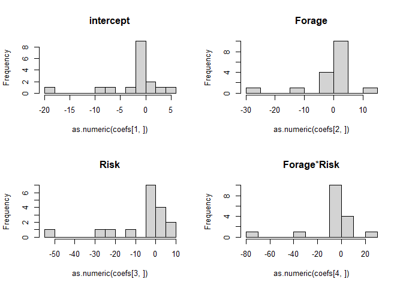<!-- --> So a
biological conclusions is that there is substantial variation between
individuals in their coefficients for forage, wolf predation risk and
the interaction.

# Mixed-Effects Models!

## Mixed-effects model with random intercept

We will review again in class what a random intercept means in the
context of a Used-Available Design. Lets start by fitting the model with
a random intercept for each individual elk. The key paper here is:

Gillies, C., M. Hebblewhite, S. E. Nielsen, M. Krawchuk, C. Aldridge, J.
Frair, C. Stevens, D. J. Saher, and C. Jerde. 2006. Application of
random effects to the study of resource selection by animals. Journal of
Animal Ecology 75:887-898.

``` r
fr.ri = glmer(used~totalherb_sc+ctotrisk_sc+ctotrisk_sc*totalherb_sc+(1|elkuid), data=elk2,family=binomial(link="logit"), verbose=FALSE)
summary(fr.ri)
```

    ## Generalized linear mixed model fit by maximum likelihood (Laplace
    ##   Approximation) [glmerMod]
    ##  Family: binomial  ( logit )
    ## Formula: used ~ totalherb_sc + ctotrisk_sc + ctotrisk_sc * totalherb_sc +  
    ##     (1 | elkuid)
    ##    Data: elk2
    ## 
    ##      AIC      BIC   logLik deviance df.resid 
    ##  39038.6  39080.8 -19514.3  39028.6    34385 
    ## 
    ## Scaled residuals: 
    ##     Min      1Q  Median      3Q     Max 
    ## -36.423  -0.704  -0.409   0.752   2.443 
    ## 
    ## Random effects:
    ##  Groups Name        Variance Std.Dev.
    ##  elkuid (Intercept) 0.624    0.7899  
    ## Number of obs: 34390, groups:  elkuid, 17
    ## 
    ## Fixed effects:
    ##                          Estimate Std. Error z value Pr(>|z|)    
    ## (Intercept)               0.35898    0.19228   1.867 0.061903 .  
    ## totalherb_sc              0.96747    0.01913  50.579  < 2e-16 ***
    ## ctotrisk_sc               0.05316    0.01468   3.621 0.000293 ***
    ## totalherb_sc:ctotrisk_sc -0.14112    0.01133 -12.450  < 2e-16 ***
    ## ---
    ## Signif. codes:  0 '***' 0.001 '**' 0.01 '*' 0.05 '.' 0.1 ' ' 1
    ## 
    ## Correlation of Fixed Effects:
    ##             (Intr) ttlhr_ cttrs_
    ## totalhrb_sc  0.018              
    ## ctotrisk_sc -0.004 -0.236       
    ## ttlhrb_sc:_ -0.016 -0.308 -0.353

Lets review how to interpret the Random Effects. Here, they are saying
we have 17 elk with 34,390 rows of data, and the Std. Dev = 0.7899,
which, compared to our standardized coefficient estimates for total herb
and wolf risk are relatively huge. That is, another way of saying there
is substantial individual-level variation in resource selection between
individuals, equal to or greater than the variation in the actual
strength of selection. This is an important insight, confirming what we
already learned from our Two-stage modeling above.

Its important to look at confidence intervals around our Beta estimates,
not just the SE’s. We can compute these using confint() are a reminder.
There are multiple methods to choose from; we will use Wald here, but
note that bootstrat CI’s are generally considered the ‘best’. Refresh
here: `confint()`

``` r
confint(fr.ri, method = "Wald")
```

    ##                                2.5 %      97.5 %
    ## .sig01                            NA          NA
    ## (Intercept)              -0.01787624  0.73583369
    ## totalherb_sc              0.92997862  1.00495791
    ## ctotrisk_sc               0.02438597  0.08193378
    ## totalherb_sc:ctotrisk_sc -0.16333261 -0.11890183

`confint(fr.ri, method = "boot")` `confint(fr.ri, method = "profile")`

Lets remind ourselves of the model structure and ‘new’ parameters being
estimated with the 95% confidence intervals graphically.

``` r
ggcoef(fr.ri)
```

    ## Warning: Removed 1 rows containing missing values (`geom_errorbarh()`).

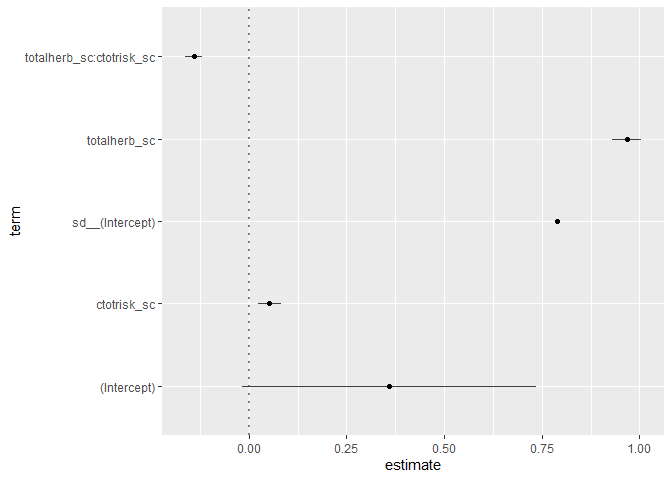<!-- --> Note now we
have 1 more parameter being estimated, the sd in the intercept. This
counts in parameters towards AIC - never forget it.

# Learning about How GLMM’s are Being Fit

By default, R is fitting the GLMM by Laplace approximation to the MLE
estimator, which by default is 1 decimal place/point (numerical
integration points) at which the model is fit with Adaptive
Gauss-Hermite Quadrature. The recommended \# of nip points is \>\> 5 for
most binomial GLMM’s. We set this by changing the nACQ - integer
scalar’s.

nAGQ- integer scalar - the number of points per axis for evaluating the
adaptive Gauss-Hermite approximation to the log-likelihood. Defaults to
1, corresponding to the Laplace approximation. Values greater than 1
produce greater accuracy in the evaluation of the log-likelihood at the
expense of speed. A value of zero uses a faster but less exact form of
parameter estimation for GLMMs by optimizing the random effects and the
fixed-effects coefficients in the penalized iteratively reweighted least
squares step. The key paper is:

Rabe-Hesketh, S., A. Skrondal, and A. Pickles. 2005. Maximum Likelihood
Estimation of Limited and Discrete Dependent Variable Models With Nested
Random Effects. Journal of Econometrics 128:301-323.

``` r
fr.ri2 = glmer(used~totalherb_sc+ctotrisk_sc+ctotrisk_sc*totalherb_sc+(1|elkuid), data=elk2,family=binomial(link="logit"), verbose=FALSE, nAGQ = 10)
summary(fr.ri2)
```

    ## Generalized linear mixed model fit by maximum likelihood (Adaptive
    ##   Gauss-Hermite Quadrature, nAGQ = 10) [glmerMod]
    ##  Family: binomial  ( logit )
    ## Formula: used ~ totalherb_sc + ctotrisk_sc + ctotrisk_sc * totalherb_sc +  
    ##     (1 | elkuid)
    ##    Data: elk2
    ## 
    ##      AIC      BIC   logLik deviance df.resid 
    ##  39038.6  39080.8 -19514.3  39028.6    34385 
    ## 
    ## Scaled residuals: 
    ##     Min      1Q  Median      3Q     Max 
    ## -36.423  -0.704  -0.409   0.752   2.443 
    ## 
    ## Random effects:
    ##  Groups Name        Variance Std.Dev.
    ##  elkuid (Intercept) 0.624    0.7899  
    ## Number of obs: 34390, groups:  elkuid, 17
    ## 
    ## Fixed effects:
    ##                          Estimate Std. Error z value Pr(>|z|)    
    ## (Intercept)               0.35899    0.19242   1.866 0.062091 .  
    ## totalherb_sc              0.96747    0.01913  50.576  < 2e-16 ***
    ## ctotrisk_sc               0.05316    0.01468   3.621 0.000294 ***
    ## totalherb_sc:ctotrisk_sc -0.14112    0.01133 -12.450  < 2e-16 ***
    ## ---
    ## Signif. codes:  0 '***' 0.001 '**' 0.01 '*' 0.05 '.' 0.1 ' ' 1
    ## 
    ## Correlation of Fixed Effects:
    ##             (Intr) ttlhr_ cttrs_
    ## totalhrb_sc  0.018              
    ## ctotrisk_sc -0.004 -0.236       
    ## ttlhrb_sc:_ -0.016 -0.308 -0.353

Note there really is no major effect in this dataset. But - good to
know. Also note that it takes a lot longer to fit the model.

## Comparing Random Intercept Model and Two-Stage Model Coefficients

It is often useful to compare the beta coefficients from ‘manual’
two-stage models, and the random intercept model to help you interpret
them. We extract the coefficients from a random effects model using two
sets of commands: `fixef()` which extracts the fixed-effects
coefficients. And `ranef()` which extracts the random effects, which in
this model is just (1\|elkuid), so, one coefficient for each individual
elk

``` r
# Useful functions
fixef(fr.ri) 
```

    ##              (Intercept)             totalherb_sc              ctotrisk_sc 
    ##               0.35897872               0.96746826               0.05315987 
    ## totalherb_sc:ctotrisk_sc 
    ##              -0.14111722

``` r
ranef(fr.ri)
```

    ## $elkuid
    ##     (Intercept)
    ## 2   -0.61651758
    ## 5    0.37150546
    ## 25  -0.88923223
    ## 29  -1.29738845
    ## 42   0.06149757
    ## 56  -1.13596429
    ## 59   1.25608125
    ## 73   0.63417712
    ## 74  -0.40051735
    ## 78   1.11915618
    ## 90   1.14404348
    ## 92   0.95250057
    ## 93   0.13830464
    ## 94  -0.51034493
    ## 96  -0.50308887
    ## 104 -0.22089641
    ## 196 -0.11537114
    ## 
    ## with conditional variances for "elkuid"

Compare these to the fixed effect coefficients estimated with an
intercept for each individual elk? How do they compare?

Or, we can look at both fixed- and random-effects from a random effects
model using this where the intercept is the fixed effect intercept + the
random effect intercept for elkuid = 1…n. 

``` r
coef(fr.ri) 
```

    ## $elkuid
    ##     (Intercept) totalherb_sc ctotrisk_sc totalherb_sc:ctotrisk_sc
    ## 2   -0.25753886    0.9674683  0.05315987               -0.1411172
    ## 5    0.73048419    0.9674683  0.05315987               -0.1411172
    ## 25  -0.53025351    0.9674683  0.05315987               -0.1411172
    ## 29  -0.93840973    0.9674683  0.05315987               -0.1411172
    ## 42   0.42047630    0.9674683  0.05315987               -0.1411172
    ## 56  -0.77698557    0.9674683  0.05315987               -0.1411172
    ## 59   1.61505997    0.9674683  0.05315987               -0.1411172
    ## 73   0.99315584    0.9674683  0.05315987               -0.1411172
    ## 74  -0.04153863    0.9674683  0.05315987               -0.1411172
    ## 78   1.47813490    0.9674683  0.05315987               -0.1411172
    ## 90   1.50302220    0.9674683  0.05315987               -0.1411172
    ## 92   1.31147930    0.9674683  0.05315987               -0.1411172
    ## 93   0.49728336    0.9674683  0.05315987               -0.1411172
    ## 94  -0.15136621    0.9674683  0.05315987               -0.1411172
    ## 96  -0.14411015    0.9674683  0.05315987               -0.1411172
    ## 104  0.13808232    0.9674683  0.05315987               -0.1411172
    ## 196  0.24360758    0.9674683  0.05315987               -0.1411172
    ## 
    ## attr(,"class")
    ## [1] "coef.mer"

Note this shows you the entire coefficient matrix for all individual
elk - note that the rest of the model is fixed for each individual elk.

Next we will compare the intercepts from two step and mixed-effects
model. This forces us to think about what the interpretation of a random
intercept is in a used-available design. First, I out everything in one
place; I add the fixed intercept to the random effects here.Note you
could also get this from coef(fr.ri) as we just did.

``` r
B0 <- cbind(as.numeric(coefs[1,]),ranef(fr.ri)$elkuid[,1]+fixef(fr.ri)[1])
rownames(B0)=rownames(ranef(fr.ri)$elkuid)
colnames(B0) = c("Two-Step","Random Effects")
str(B0)
```

    ##  num [1:17, 1:2] -0.687 -3.688 -0.83 -1.152 0.684 ...
    ##  - attr(*, "dimnames")=List of 2
    ##   ..$ : chr [1:17] "2" "5" "25" "29" ...
    ##   ..$ : chr [1:2] "Two-Step" "Random Effects"

``` r
B0
```

    ##         Two-Step Random Effects
    ## 2    -0.68694548    -0.25753886
    ## 5    -3.68815760     0.73048419
    ## 25   -0.82978822    -0.53025351
    ## 29   -1.15242253    -0.93840973
    ## 42    0.68351196     0.42047630
    ## 56   -0.68528659    -0.77698557
    ## 59  -19.18118331     1.61505997
    ## 73   -9.39408620     0.99315584
    ## 74   -0.09685491    -0.04153863
    ## 78   -7.75776140     1.47813490
    ## 90    4.58743932     1.50302220
    ## 92    1.27108698     1.31147930
    ## 93    2.73791698     0.49728336
    ## 94   -0.41491070    -0.15136621
    ## 96   -0.19665647    -0.14411015
    ## 104  -0.35634342     0.13808232
    ## 196  -1.42667197     0.24360758

``` r
par(mfrow=c(1,1))
plot(B0[,1], B0[, 2])
abline(lm(B0[,1] ~ B0[, 2]))
```

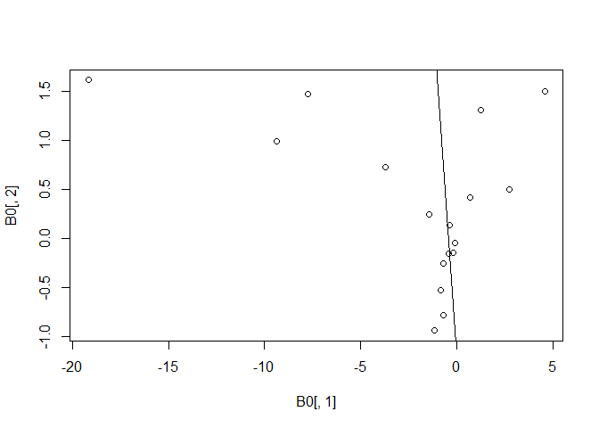<!-- --> This plot
shows the Two-step coefficients for each individual elk on the X axix,
and the random coefficient for each individual elk from the GLMM on the
Y-axis. What do you notice? What are the axes of Y and X here? Should
there be a relationship between these two?

Suprisingly, there is no real relationship between the fixed-effects
estimates from the two-stage models for the intercept. Why is this? Lets
take a look at the histogram of both:

``` r
# Make a histogram using the package plotrix
multhist(list(B0[,1],B0[,2]), xlab = "Intercept Coefficient",ylab="Frequency (# Elk)", col = c("gray","tan"))
legend("topright", legend = colnames(B0), fill = c("gray","tan"), bty = "n")
```

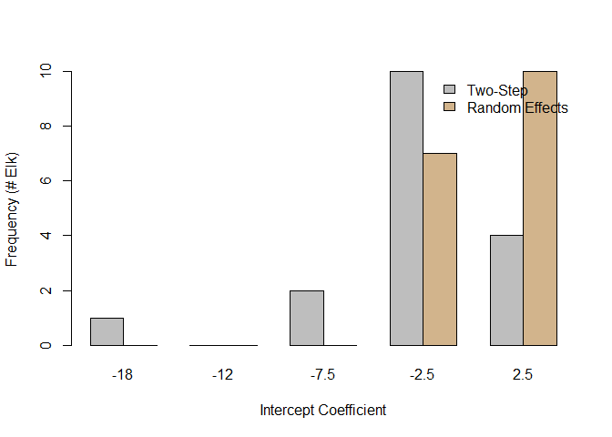<!-- --> This
histogram shows us that the mixed-effects model is estimating the
distribution of random intercepts here as ‘more’ gaussian/normally
distributed than the Two-stage data. This introduces us to the new 6th
assumption of any GLMM, here, binomial. Remember assumptions 1 - 4:

1.  That the data are independent.
2.  That they are identically distributed, whether it be normal \~ N(0,
    sigma), binomial, etc.  
3.  That the X’s are measured without error.
4.  That the data are homogenously distributed.
5.  In Multiple regression, the X’s are independent.

And, now, with GLMM, 6. That the random effects are distributed as a
gaussian random variable with mean mu, and variance sigma squared.

It is this new 6th assumption, that the random effects have a
DISTRIBUTION, whic is causing the shrinkage in the estimated beta
coefficients for the intercept. We will discuss this assumption later in
class. But go back and look at the estimated beta coefficients in Figure
1 above for wolves.

So far, we have just accounted for the first and second problem that
random effects are well-suited to address, 1. modeled heterogeneity, and
2. variation in sampling intensity between individuals. This has nothing
to do with actual differences in how elk respond to forage or predation.
for this, we need the final ingredient, adding random coefficients.

## Random Coefficients - Mixed Effects Model with Random Coefficient

Based on our previous two-step models above, we can see there is a lot
more variation in the response of elk to total predation risk. So, here
we will fit random coefficients for the first time to wolf predation
risk.

``` r
fr.rc = glmer(used~totalherb_sc+ctotrisk_sc+totalherb_sc*ctotrisk_sc+(ctotrisk_sc|elkuid), data=elk2,family=binomial(link="logit"), verbose=FALSE)

fixef(fr.rc) # This is the fixed effects coefficients
```

    ##              (Intercept)             totalherb_sc              ctotrisk_sc 
    ##               -1.3476323                0.9977270               -4.0797889 
    ## totalherb_sc:ctotrisk_sc 
    ##               -0.1339487

``` r
ranef(fr.rc) # These are the random effects, which in this model is just (1|elkuid), so, one coefficient for each individual elk
```

    ## $elkuid
    ##     (Intercept) ctotrisk_sc
    ## 2     1.0065708    4.412442
    ## 5    -1.9594475   -6.573332
    ## 25    0.8565062    3.886791
    ## 29    0.4056776    4.264228
    ## 42    1.8008174    4.432449
    ## 56    0.6856793    3.960936
    ## 59   -9.8807653  -28.264990
    ## 73   -1.6320217   -5.778111
    ## 74    1.2846912    3.831488
    ## 78   -0.8906805   -5.099044
    ## 90   -1.0180529   -5.365353
    ## 92    2.6447395    3.714413
    ## 93    2.5845361    6.100832
    ## 94    1.0761475    4.329782
    ## 96    1.2005023    4.036716
    ## 104   1.3594033    3.630019
    ## 196   0.5456046    4.643823
    ## 
    ## with conditional variances for "elkuid"

First, note that fitting random coefficients took a long time with EVEN
this modest dataset. Compare these to the fixed effect coefficients
estimated with an intercept for each individual elk? How do they
compare?

``` r
coef(fr.rc)
```

    ## $elkuid
    ##      (Intercept) totalherb_sc  ctotrisk_sc totalherb_sc:ctotrisk_sc
    ## 2    -0.34106150     0.997727   0.33265291               -0.1339487
    ## 5    -3.30707975     0.997727 -10.65312073               -0.1339487
    ## 25   -0.49112609     0.997727  -0.19299807               -0.1339487
    ## 29   -0.94195467     0.997727   0.18443860               -0.1339487
    ## 42    0.45318514     0.997727   0.35265987               -0.1339487
    ## 56   -0.66195296     0.997727  -0.11885249               -0.1339487
    ## 59  -11.22839755     0.997727 -32.34477867               -0.1339487
    ## 73   -2.97965400     0.997727  -9.85789948               -0.1339487
    ## 74   -0.06294114     0.997727  -0.24830081               -0.1339487
    ## 78   -2.23831276     0.997727  -9.17883246               -0.1339487
    ## 90   -2.36568517     0.997727  -9.44514187               -0.1339487
    ## 92    1.29710722     0.997727  -0.36537608               -0.1339487
    ## 93    1.23690379     0.997727   2.02104314               -0.1339487
    ## 94   -0.27148481     0.997727   0.24999342               -0.1339487
    ## 96   -0.14713003     0.997727  -0.04307329               -0.1339487
    ## 104   0.01177097     0.997727  -0.44976958               -0.1339487
    ## 196  -0.80202769     0.997727   0.56403419               -0.1339487
    ## 
    ## attr(,"class")
    ## [1] "coef.mer"

``` r
##### Note here that the coefficient for predation risk is allowed to vary
summary(fr.rc)
```

    ## Generalized linear mixed model fit by maximum likelihood (Laplace
    ##   Approximation) [glmerMod]
    ##  Family: binomial  ( logit )
    ## Formula: used ~ totalherb_sc + ctotrisk_sc + totalherb_sc * ctotrisk_sc +  
    ##     (ctotrisk_sc | elkuid)
    ##    Data: elk2
    ## 
    ##      AIC      BIC   logLik deviance df.resid 
    ##  38338.0  38397.1 -19162.0  38324.0    34383 
    ## 
    ## Scaled residuals: 
    ##    Min     1Q Median     3Q    Max 
    ##    -44     -1      0      1  64054 
    ## 
    ## Random effects:
    ##  Groups Name        Variance Std.Dev. Corr
    ##  elkuid (Intercept)  8.53    2.921        
    ##         ctotrisk_sc 72.82    8.533    0.97
    ## Number of obs: 34390, groups:  elkuid, 17
    ## 
    ## Fixed effects:
    ##                          Estimate Std. Error z value Pr(>|z|)    
    ## (Intercept)              -1.34763    0.65136  -2.069   0.0386 *  
    ## totalherb_sc              0.99773    0.01972  50.598   <2e-16 ***
    ## ctotrisk_sc              -4.07979    1.86042  -2.193   0.0283 *  
    ## totalherb_sc:ctotrisk_sc -0.13395    0.01414  -9.474   <2e-16 ***
    ## ---
    ## Signif. codes:  0 '***' 0.001 '**' 0.01 '*' 0.05 '.' 0.1 ' ' 1
    ## 
    ## Correlation of Fixed Effects:
    ##             (Intr) ttlhr_ cttrs_
    ## totalhrb_sc -0.015              
    ## ctotrisk_sc  0.966 -0.019       
    ## ttlhrb_sc:_  0.004 -0.206  0.005

Again, look at the Std.Dev of the random effects for elkuid (intercept)
and wolfpredation risk, 8.533. That is DOUBLE the strength of the
coefficient for wolf predation risk in the model. Also note that the
coefficient for wolf predation risk has dramatically changed, becoming
much stronger now.

NExt, we now see the correlation between the two random effects here,
which is 0.97. This means that there is a positive covariance between
animals with a high value for a random intercept, and animals with a
larger coefficient (more positive) for wolf predation risk. Interpreting
this is tricky. Think of what a positive intercept means in a
used-available design - this means that they have more 1’s than 0’s, so,
a smaller home range the way that we sampled availability based on areal
extent. Why would animals with small home ranges be ‘selecting’ areas of
higher predation risk compared to animals with larger home ranges? This
is a real ecologically interesting question to ponder with this dataset.

We also see below the output the Correlation of Fixed Effects: This is a
bit tricky to interpret. The “correlation of fixed effects” output
doesn’t have the intuitive meaning that most would ascribe to it.
Specifically, is not about the correlation of the variables. It is in
fact about the expected correlation of the regression coefficients.
Although this may speak to multicollinearity it does not necessarily. In
this case it is telling you that if you did the experiment again and it
so happened that the coefficient for forage got smaller, it would not be
correlated with the coefficient for wolf predation risk. In fact, in
these Correlations of fixed effects, there is nothing too alarming here;
the fact that wolf predation risk and the intercept values were
positively correlated was already noted above with the random effects,
and discussed above. But, if these fixed-effect coefficients were highly
correlated, and the real coefficients, not just the intercepts, that
would be more problematic and might suggest problems with confounding or
collinearity.

## Lets Visualize the Random Intercept and Coefficient

We use the lattice package.

``` r
lattice::dotplot(ranef(fr.rc, condVar = TRUE))
```

    ## $elkuid

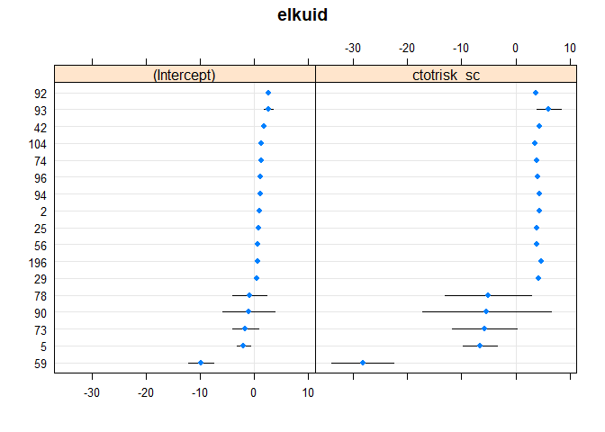<!-- -->

## Compare Parameters between Two-stage and Mixed-Models

Note that I use the coef function here

``` r
B0.rc = cbind(as.numeric(coefs[1,]),coef(fr.rc)$elkuid[,1])
rownames(B0.rc)=rownames(ranef(fr.ri)$elkuid)
colnames(B0.rc) = c("Two-Step","Random Effects")
B.risk = cbind(as.numeric(coefs[3,]),coef(fr.rc)$elkuid[,3])
rownames(B.risk)=rownames(ranef(fr.ri)$elkuid)
colnames(B.risk) = c("Two-Step","Random Effects")

## lets look at the Intercepts
B0.rc
```

    ##         Two-Step Random Effects
    ## 2    -0.68694548    -0.34106150
    ## 5    -3.68815760    -3.30707975
    ## 25   -0.82978822    -0.49112609
    ## 29   -1.15242253    -0.94195467
    ## 42    0.68351196     0.45318514
    ## 56   -0.68528659    -0.66195296
    ## 59  -19.18118331   -11.22839755
    ## 73   -9.39408620    -2.97965400
    ## 74   -0.09685491    -0.06294114
    ## 78   -7.75776140    -2.23831276
    ## 90    4.58743932    -2.36568517
    ## 92    1.27108698     1.29710722
    ## 93    2.73791698     1.23690379
    ## 94   -0.41491070    -0.27148481
    ## 96   -0.19665647    -0.14713003
    ## 104  -0.35634342     0.01177097
    ## 196  -1.42667197    -0.80202769

Next, lets look at the risk coefficients

``` r
B.risk
```

    ##          Two-Step Random Effects
    ## 2     0.831642892     0.33265291
    ## 5   -10.532197770   -10.65312073
    ## 25   -0.008045513    -0.19299807
    ## 29    0.266537869     0.18443860
    ## 42    1.214137203     0.35265987
    ## 56   -0.442680972    -0.11885249
    ## 59  -52.418020977   -32.34477867
    ## 73  -27.132288060    -9.85789948
    ## 74   -0.324328217    -0.24830081
    ## 78  -23.619988516    -9.17883246
    ## 90    6.803137015    -9.44514187
    ## 92   -0.414961114    -0.36537608
    ## 93    5.729256627     2.02104314
    ## 94   -0.276774082     0.24999342
    ## 96   -0.464404415    -0.04307329
    ## 104  -2.017528782    -0.44976958
    ## 196   0.705119288     0.56403419

So, quite correlated from the 2 different models

``` r
plot(B.risk[,1], B.risk[,2])
abline(lm(B.risk[,1] ~ B.risk[, 2]))
```

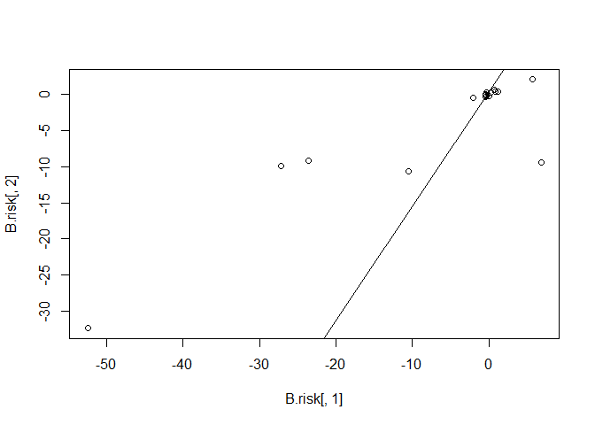<!-- --> So here
there is some correlation between the coefficients for predation risk
from the Two-stage models (X-axis) and the glmm (Y axis). Now we are
getting somewhere and this is starting to make more sense. Remember the
intercepts are not really that meaningful in these Used-available rSF
models, but here we see correlation in the coefficients - what matters.

Lets look at histograms of the Beta coefficients to visualize the
difference in the two-stage beta’s (without the 6th assumption of GLMM)
and those of the GLMM where the distribution of random effects is
assumed to be normal.

``` r
# Make histogram of betas
par(mfrow = c(1,2))
multhist(list(B0.rc[,1],B0.rc[,2]), xlab = "Intercept Coefficient",ylab="Frequency (# Elk)", col = c("gray","tan"), ylim=c(0,10))
legend(2.4,10, legend = colnames(B0), fill = c("gray","tan"), bty = "n")
multhist(list(B.risk[,1],B.risk[,2]), xlab = "Risk Coefficient",ylab="Frequency (# Elk)", col = c("gray","tan"),ylim = c(0,10))
legend(2.4,10, legend = colnames(B0), fill = c("gray","tan"), bty = "n")
```

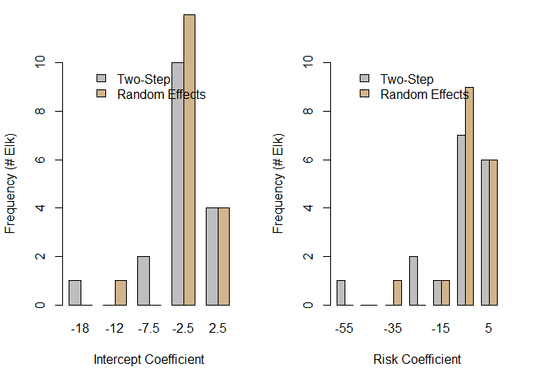<!-- --> What is the
assumption about the distribution of the random effects doing to the
modeled responses here?

# Model Selection with Random Effects

Finally, one might be tempted to rely on AIC to tell us which model is
the best. Lets take a look!

``` r
AIC(forriskFI, forage, risk, forANDrisk, forrisk, fr.ri, fr.rc)
```

    ##            df      AIC
    ## forriskFI  20 38961.48
    ## forage      2 42568.69
    ## risk        2 47525.47
    ## forANDrisk  3 42428.53
    ## forrisk     4 42215.78
    ## fr.ri       5 39038.60
    ## fr.rc       7 38337.99

So hands down, the top model here is a random effect of wolf predation
risk, beating even the fixed-effect of each individual elk as an
intercept (forriskFI). Note that model selection with random effects
models gets a lot more complicated… here we are doing model selection on
the Fixed-effects only. What I mean is that it is possible to do model
selection not only on the fixed-effects, but also the random effects.
This is especially complicated in multi-level models with more than one
hierarchy, like wolves in packs. Or children in schools in school
districts (3). Now one can do model selection at each level of the
hierarchy over and above the fixed-effects. See:

Vaida, F., and S. Blanchard. 2005. Conditional Akaike information for
mixed-effects models. Biometrika 92:351-370.

## Comparing Models with and without Random Effects

One often wants to know, besides AIC, how much ‘better’ a top model is
with a random effect compared to one without. How do we determine the
“importance/significance” of the random effect?

- Compare estimate of random effects SD to the magnitude of the fixed
  effect
- If the values are close, this means that the random effect groups (for
  us, NewID) vary a lot relative to the magnitude of the effect of mass
- Use a likelihood ratio test (anova()) to compare the output of the
  model with and without the random effect \* One other thing to keep in
  mind is that if we are including random effect(s) in our model because
  of experimental/survey design (for example because of non-independence
  between samples), then significance is not really that important, and
  they should be included regardless.

Lets use ANOVA to conduct a LRT of the hypothesis that the full random
effects model with a random coefficient and intercept fit ‘better’ than
the null, fixed-effects model. Always put the more complex model, the
GLMM in this case, first.

``` r
anova(fr.rc, forrisk, test = "Chisq") ## put GLMM first
```

    ## Data: elk2
    ## Models:
    ## forrisk: used ~ totalherb + ctotrisk + ctotrisk * totalherb
    ## fr.rc: used ~ totalherb_sc + ctotrisk_sc + totalherb_sc * ctotrisk_sc + (ctotrisk_sc | elkuid)
    ##         npar   AIC   BIC logLik deviance  Chisq Df Pr(>Chisq)    
    ## forrisk    4 42216 42250 -21104    42208                         
    ## fr.rc      7 38338 38397 -19162    38324 3883.8  3  < 2.2e-16 ***
    ## ---
    ## Signif. codes:  0 '***' 0.001 '**' 0.01 '*' 0.05 '.' 0.1 ' ' 1

Here, AIC and BIC are much MUCH better, the LL is higher, and the
chi-square is \>\>\> which tells us that the fr.rc model is a huge
improvemetn in fit. Lets compare the random intercept only model.

``` r
anova(fr.rc, fr.ri, test = "Chisq") ## put GLMM first
```

    ## Data: elk2
    ## Models:
    ## fr.ri: used ~ totalherb_sc + ctotrisk_sc + ctotrisk_sc * totalherb_sc + (1 | elkuid)
    ## fr.rc: used ~ totalherb_sc + ctotrisk_sc + totalherb_sc * ctotrisk_sc + (ctotrisk_sc | elkuid)
    ##       npar   AIC   BIC logLik deviance  Chisq Df Pr(>Chisq)    
    ## fr.ri    5 39039 39081 -19514    39029                         
    ## fr.rc    7 38338 38397 -19162    38324 704.61  2  < 2.2e-16 ***
    ## ---
    ## Signif. codes:  0 '***' 0.001 '**' 0.01 '*' 0.05 '.' 0.1 ' ' 1

Not as huge an improvement, but, still a big jump in improvement.

## Variance Explained by GLMM’s

We can get the summary of the model fit in an alternative way using the
summ() function from the ‘jtools’ package. This provides a value for
Pseudo-R-squared. The first value is the marginal R-squared describes
the proportion of variance explained by the fixed factor(s) alone. The
second value is the conditional R-squared describes the proportion of
variance explained by both the fixed and random factors

``` r
jtools::summ(fr.rc, confint = TRUE, digits =2)
```

    ## MODEL INFO:
    ## Observations: 34390
    ## Dependent Variable: used
    ## Type: Mixed effects generalized linear regression
    ## Error Distribution: binomial
    ## Link function: logit 
    ## 
    ## MODEL FIT:
    ## AIC = 38337.99, BIC = 38397.10
    ## Pseudo-R² (fixed effects) = 0.16
    ## Pseudo-R² (total) = 0.97 
    ## 
    ## FIXED EFFECTS:
    ## ----------------------------------------------------------------------
    ##                                   Est.    2.5%   97.5%   z val.      p
    ## ------------------------------ ------- ------- ------- -------- ------
    ## (Intercept)                      -1.35   -2.62   -0.07    -2.07   0.04
    ## totalherb_sc                      1.00    0.96    1.04    50.60   0.00
    ## ctotrisk_sc                      -4.08   -7.73   -0.43    -2.19   0.03
    ## totalherb_sc:ctotrisk_sc         -0.13   -0.16   -0.11    -9.47   0.00
    ## ----------------------------------------------------------------------
    ## 
    ## RANDOM EFFECTS:
    ## ----------------------------------
    ##  Group     Parameter    Std. Dev. 
    ## -------- ------------- -----------
    ##  elkuid   (Intercept)     2.92    
    ##  elkuid   ctotrisk_sc     8.53    
    ## ----------------------------------
    ## 
    ## Grouping variables:
    ## --------------------------
    ##  Group    # groups   ICC  
    ## -------- ---------- ------
    ##  elkuid      17      0.72 
    ## --------------------------

We can also look at the intra-class correlation value using the icc()
function from ‘sjstats’ package. First let’s use it on an intercept-only
model on our elk data, then our model with the random effect of unit.

``` r
performance::icc(fr.rc)
```

    ## # Intraclass Correlation Coefficient
    ## 
    ##     Adjusted ICC: 0.961
    ##   Unadjusted ICC: 0.811

This value tells us how much variation in the response comes from the
grouping/clustering structure of our data. Here it is high, so, as the
likelihood ratio test for this data set also indicated, there is support
for including the random effect. Let’s compare this to the intra-class
correclation value from our model with only a random intercept for
individual elk.

``` r
performance::icc(fr.ri)
```

    ## # Intraclass Correlation Coefficient
    ## 
    ##     Adjusted ICC: 0.159
    ##   Unadjusted ICC: 0.131

Which again aligns with our LRT results.

# Predictions from GLMM RSF models.

A related concept to the challenge of model selection with either the
fixed- or conditional- effects is prediction. Obtaining predictions from
GLMM Models is tricky. What are you trying to predict is the challenging
question? Marginal or population-averaged responses? Conditional or
subject specific responses?

Moreover, a challenge remains in how best to actually use the models
with random effects in it to make predictions, so there are a number of
packages and discussions that essentially recommend bootrapping or
simulation approaches. All of this ends up taking us to a Bayesian
framework eventually.

## Plotting Predictions from Random Coefficient models

We will make predictions here using the fixed-effect coefficients (i.e.,
a marginal level prediction).

First lets refit the top model with out scaled coefficients - note this
takes a LOT longer. Why am i doing this? To predict in the REAL scale!
Models fit with scaled covariates make predictions in standard deviation
units.

``` r
fr.rc2 = glmer(used~totalherb+ctotrisk+totalherb*ctotrisk+(ctotrisk|elkuid), data=elk2,family=binomial(link="logit"), verbose=FALSE)
```

    ## Warning in checkConv(attr(opt, "derivs"), opt$par, ctrl = control$checkConv, : Model is nearly unidentifiable: very large eigenvalue
    ##  - Rescale variables?;Model is nearly unidentifiable: large eigenvalue ratio
    ##  - Rescale variables?

``` r
summary(fr.rc2)
```

    ## Generalized linear mixed model fit by maximum likelihood (Laplace
    ##   Approximation) [glmerMod]
    ##  Family: binomial  ( logit )
    ## Formula: used ~ totalherb + ctotrisk + totalherb * ctotrisk + (ctotrisk |  
    ##     elkuid)
    ##    Data: elk2
    ## 
    ##      AIC      BIC   logLik deviance df.resid 
    ##  38338.0  38397.1 -19162.0  38324.0    34383 
    ## 
    ## Scaled residuals: 
    ##    Min     1Q Median     3Q    Max 
    ##    -44     -1      0      1  64059 
    ## 
    ## Random effects:
    ##  Groups Name        Variance  Std.Dev. Corr 
    ##  elkuid (Intercept)    0.9422  0.9707       
    ##         ctotrisk    5767.8285 75.9462  -0.73
    ## Number of obs: 34390, groups:  elkuid, 17
    ## 
    ## Fixed effects:
    ##                      Estimate Std. Error z value Pr(>|z|)    
    ## (Intercept)        -4.991e-01  1.747e-01  -2.856  0.00429 ** 
    ## totalherb           4.022e-02  8.284e-04  48.550  < 2e-16 ***
    ## ctotrisk           -3.535e+01  5.288e+00  -6.685 2.31e-11 ***
    ## totalherb:ctotrisk -4.552e-02  4.804e-03  -9.475  < 2e-16 ***
    ## ---
    ## Signif. codes:  0 '***' 0.001 '**' 0.01 '*' 0.05 '.' 0.1 ' ' 1
    ## 
    ## Correlation of Fixed Effects:
    ##             (Intr) ttlhrb cttrsk
    ## totalherb   -0.083              
    ## ctotrisk    -0.279 -0.005       
    ## ttlhrb:cttr  0.037 -0.458  0.000
    ## optimizer (Nelder_Mead) convergence code: 0 (OK)
    ## Model is nearly unidentifiable: very large eigenvalue
    ##  - Rescale variables?
    ## Model is nearly unidentifiable: large eigenvalue ratio
    ##  - Rescale variables?

Next we will plot predictions from random coefficient model. First we
will remove NAs from the data

``` r
elk.c = elk2[which((elk2$ctotrisk!="NA"&elk2$totalherb!="NA")==TRUE),]
```

Then we will plot observed use for each elk by looping over each elkuid.

``` r
par(mfrow = c(1,1))
plot(elk.c$ctotrisk, elk.c$used,xlab="Risk",ylab="Pr(Use)")
elkids = sort(unique(elk.c$elkuid))
ltypes = rep(1:6,each=3)
lwide = rep(seq(1,3,1),each = 6)
colors = rep(c("red","black","seagreen", "violet", "tan", "orange"),3)

# Begin loop
for (i in elkids){
  # To plot predictions you need to create new data for just that elk
  dat = as.data.frame(model.matrix(terms(fr.rc2),elk.c)[elk.c$elkuid==i,])
  dat$totalherb = mean(dat$totalherb) # Use the mean forage for an elk
  dat[,colnames(dat)=="totalherb:ctotrisk"] = dat$totalherb*dat$ctotrisk # Recalculate the interaction term with the mean forage
  dat$pred.prob = plogis(as.matrix(dat)%*%t(as.matrix(coef(fr.rc2)$elkuid[which(elkids==i),]))) # Use matrix algebra to get prediction based on coefficients for each individual elk
  ord = order(dat$ctotrisk) # store the order we want to plot in
  # Draw a line for you prediction
  lines(dat$ctotrisk[ord], dat$pred.prob[ord], lty=ltypes[which(elkids==i)],lwd = lwide[which(elkids==i)],col=colors[which(elkids==i)])
}

legend("right", legend = c("Observed", paste("Elk ",elkids)), pch=c(1,rep(-1,length(elkids))),lty = c(-1,ltypes[1:length(elkids)]),lwd = c(-1,lwide[1:length(elkids)]),col = c(1,colors[1:length(elkids)]), bty = "n")
```

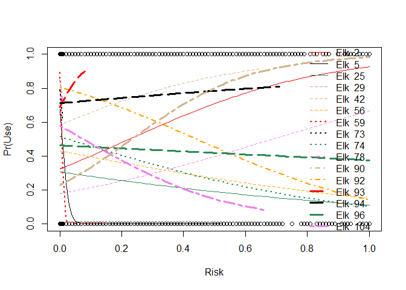<!-- -->

When I first taught this class using these data, this graph BLEW my
mind. I had happily published our 2009 paper talking all about the
marginal, population-level fixed effects. I had completely overlooked
the huge amount of individual-level variation present in even this
SIMPLE dataset. I was humbled. This lead to a french MS thesis by Amelie
Paoli with Christophe Bonenfant at Universite Lyon 1, Claude Bernard.

## Plotting Conditional Predictions with 95% CI’s

We can use a handy function in ggplot to fill by each individual elk
like this as an initial exploration, noting that this is equivalent
functionally to the two stage models above.

``` r
ggplot(elk2, aes(x=ctotrisk, y = used, colour = elkuidF)) + stat_smooth(method="glm", method.args = list(family="binomial"))
```

    ## `geom_smooth()` using formula = 'y ~ x'

    ## Warning: glm.fit: fitted probabilities numerically 0 or 1 occurred

    ## Warning: glm.fit: fitted probabilities numerically 0 or 1 occurred

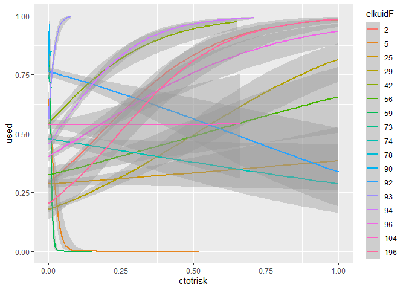<!-- --> Although a
few things are wrong with this model. First, the model predictions are
based on the fixed-effects, and fixed-effects variance (only) not taking
into account the random effects variance. So the 95% CI’s are almost
certainly overly precise compared to if they had included the random
effects variance.

Prediction is a HUGE challenge in mixed-effects models! And there are
HUGE amounts of pages dedicated to it. Here are just a few pages
<https://cran.r-project.org/web/packages/merTools/vignettes/Using_predictInterval.html>

## Predicting with predict() function

?predict.merMod

First we do the basic predictions which are the fixed-effects ignoring
random effects

``` r
elk2$naive.pred <-predict(forrisk, type = "response")
elk2$fr.rc.pred <- predict(fr.rc, type = "response")
hist(elk2$fr.rc.pred)
```

<!-- -->

Next, we do the basic predictions which are the fixed-effects
unconditional on the random effects (i.e., Naive logit)

``` r
elk2$fr.rc.pred2 <- predict(fr.rc, re.form = NA, type = "response")
summary(elk2$fr.rc.pred2)
```

    ##    Min. 1st Qu.  Median    Mean 3rd Qu.    Max. 
    ##  0.0000  0.3099  0.3763  0.3976  0.5421  0.9994

But note now we can make predictions for JUST individual elk ignoring
the variation between individuals in predation risk responses

``` r
elk2$fr.rc.pred3 <- predict(fr.rc, re.form = ~(1|elkuid) , type = "response")
summary(elk2$fr.rc.pred3)
```

    ##    Min. 1st Qu.  Median    Mean 3rd Qu.    Max. 
    ##  0.0000  0.2259  0.5848  0.5184  0.7853  0.9999

``` r
hist(elk2$fr.rc.pred3)
```

<!-- -->

Finally, we visualize relationships between different predictions, the
naive model (pred2) versus the full random intercept and random
coefficient model.

``` r
plot(elk2$fr.rc.pred2, elk2$fr.rc.pred)
```

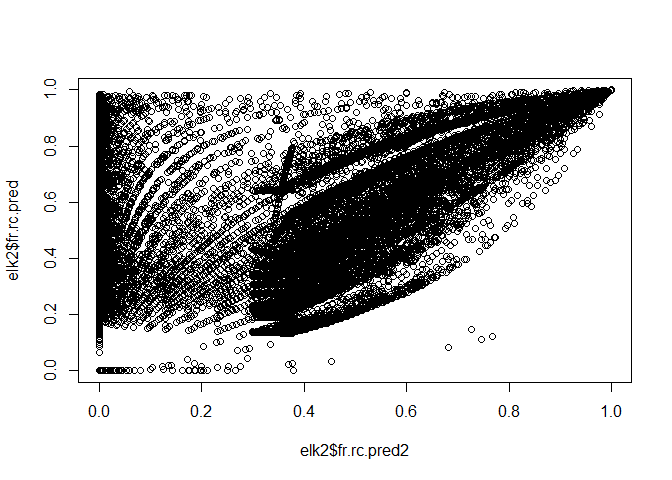<!-- --> This is the
plot of the predictions from the unconditional predictions (X) versus
the fully-specified random effects of risk\|elkid (y). But this isnt as
complicated as it can get.

``` r
ggpairs(elk2[46:49])
```

<!-- --> This plot
compares the predictions from the full mixed-effect model (fr.rc.pred),
the unconditional predictions ignoring the RE’s (fr.rc.pred2), the
predictions from the model only considering the random effect of
individual elk (not response to wolves, fr.rc.pred3), and the naive
logistic regression results ignoring everything.

## Comparing Spatial Predictions from Fixed and Mixed-effect models.

First, lets plot the same kind of predictions starting with the ‘Naive’
RSF model

``` r
ggplot(elk2, aes(utmx, utmy, col = naive.pred)) + geom_point(size=2) + coord_equal() +  scale_colour_gradient(low = 'yellow', high = 'red')
```

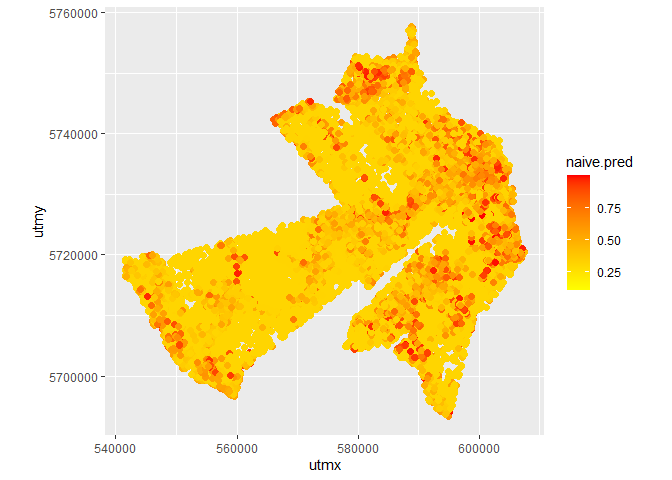<!-- --> Now the
random effects model with ctotrisk\|elkuid

``` r
ggplot(elk2, aes(utmx, utmy, col = fr.rc.pred)) + geom_point(size=2) + coord_equal() +  scale_colour_gradient(low = 'yellow', high = 'red')
```

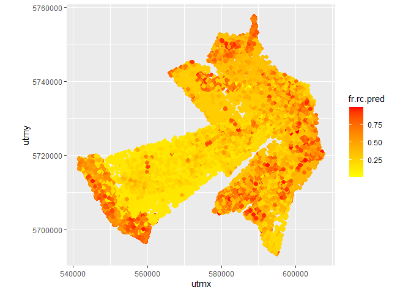<!-- --> Now the
predictions unconditioned on any random effects

``` r
ggplot(elk2, aes(utmx, utmy, col = fr.rc.pred2)) + geom_point(size=2) + coord_equal() +  scale_colour_gradient(low = 'yellow', high = 'red')
```

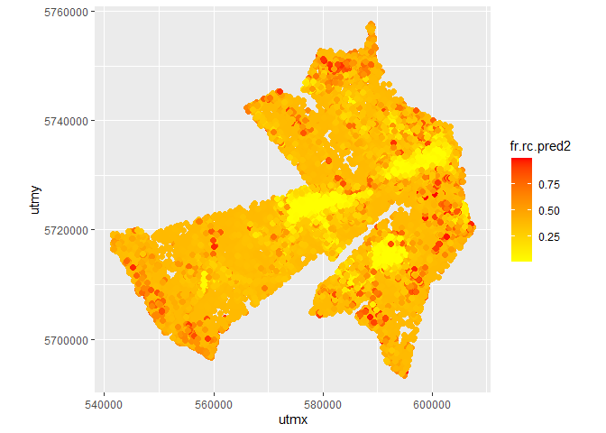<!-- --> And finally,
the spaital predictions holding effects of predation risk constant and
only considering variation between elk (not as sensible in this example)

``` r
ggplot(elk2, aes(utmx, utmy, col = fr.rc.pred3)) + geom_point(size=2) + coord_equal() +  scale_colour_gradient(low = 'yellow', high = 'red')
```

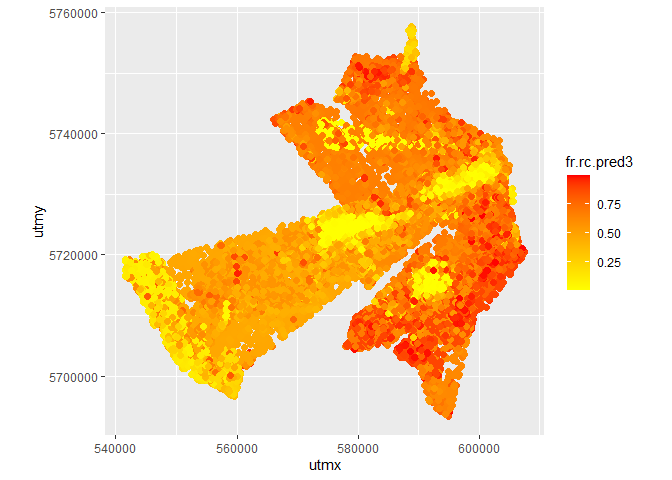<!-- -->

Class Discussion : How do these differ? What different hypotheses or
models of elk resource selection do they represent? how would you ‘tell’
which one was the best?

# Objective 7.5 Predicting using the bootMer() command

As the documentation for lme4::predict.merMod() notes:

There is no option for computing standard errors of predictions because
it is difficult to define an efficient method that incorporates
uncertainty in the variance parameters; we recommend lme4::bootMer() for
this task.

Short of a fully Bayesian analysis, bootstrapping is the gold-standard
for deriving a prediction interval predictions from a (G)LMM, but the
time required to obtain even a respectable number of replications from
bootMer() quickly becomes prohibitive when the initial model fit is on
the order of hours instead of seconds.

``` r
boot.fr.rc <- bootMer(fr.rc, FUN = function(x) as.numeric(logLik(x), nsim = 100))
boot.fr.rc$mle
```

    ## $beta
    ## [1] -1.3476323  0.9977270 -4.0797889 -0.1339487
    ## 
    ## $theta
    ##             elkuid.(Intercept) elkuid.ctotrisk_sc.(Intercept) 
    ##                       2.920651                       8.307994 
    ##             elkuid.ctotrisk_sc 
    ##                       1.947953

These are the MLE estimates of your beta coefficients given the model
structure. Or in the cases where the model is too big or complex, you
can extract the prediction intervals using predictInterval() from the
package merTools:

<https://cran.rstudio.com/web/packages/merTools/vignettes/Using_predictInterval.html>

As an example, here, say you want to extract the prediction interval for
the predicted probabilities of elk use, with their 95% CI based on
bootstrapping, taking into account the random effects variance. First,
learn more about `?predictInteval`

First, compare the predictions for the top model with random effects for
elkuid and predation risk, considering ONLY the fixed effects:

``` r
preds <- predictInterval(fr.rc, newdata = elk2, which = "fixed", n.sims = 99, stat = "median", type = "probability")
```

    ## Warning: executing %dopar% sequentially: no parallel backend registered

``` r
hist(preds)
```

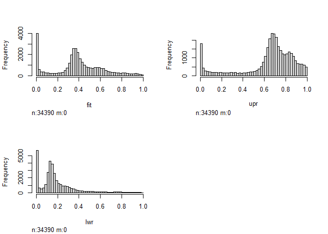<!-- -->

``` r
head(preds)
```

    ##         fit       upr       lwr
    ## 1 0.9639616 0.9883402 0.8747956
    ## 2 0.9452689 0.9864671 0.8455396
    ## 3 0.9581060 0.9901822 0.8515159
    ## 4 0.9471779 0.9884414 0.8595302
    ## 5 0.9552753 0.9859299 0.8610716
    ## 6 0.9543720 0.9881709 0.8574866

Now, consider the predictions considering the random effects variance

``` r
preds <- predictInterval(fr.rc, newdata = elk2, which = "random", n.sims = 99, stat = "median", type = "probability")
head(preds)
```

    ##         fit       upr       lwr
    ## 1 0.7049868 0.8779394 0.3999455
    ## 2 0.7266145 0.9085301 0.4541531
    ## 3 0.7539478 0.9054198 0.4671308
    ## 4 0.3982691 0.7356521 0.1979877
    ## 5 0.6764988 0.8414630 0.3277211
    ## 6 0.8240073 0.9497328 0.5942766

Note a few things - that first, the probabilities change. Second,
though, the uncertainty is MUCH wider with the random effects accounted
for.

This is a key take home message. NEVER ignore the random effects
variation!!!

# Lab 7 Excercises!

In a concise lab report answer the following questions in JUST a methods
& results/discussion format, and include your tidied up R code as an
appendix. You only need to report enough methods details specifically
about the equations and different model structures you are fitting. Due
electronically March 8th.

1.  Compare the model structures, Beta’s and SE’s for the naïve
    fixed-effects, the two-stage and the mixed-effect model structures
    (i.e., random intercept and random coefficient) for migratory GPS
    collared elk used in this lab.

2.  Make sure to write out the equations, with correct notation, for the
    naïve fixed-logit, two-stage model, and the mixed effect model. Be
    sure to define what a random effect and mixed-effect model is.

3.  What is the ‘best’ model from an AIC perspective? Compare and
    contrast the 3 different models and their inferences, advantages and
    disadvantages.

4.  Try at least 1 more complicated model - i.e., a model with 2 random
    coefficients, say. And, include this model using step 1 and 2 and 3
    above.

5.  Using the loo.R cross validation R code and .html file, and the
    ‘best’ model structure for elk, conduct leave one out cross
    validation on the top model structure by individual elk. compare to
    the top ‘naive’ model as in the loo.html file.

Resources:

<http://bbolker.github.io/mixedmodels-misc/glmmFAQ.html>

<https://bbolker.github.io/mixedmodels-misc/ecostats_chap.html>

<https://www.zoology.ubc.ca/~schluter/R/Model.html#Preliminary_notes>

<https://dynamicecology.wordpress.com/2015/11/04/is-it-a-fixed-or-random-effect/>
